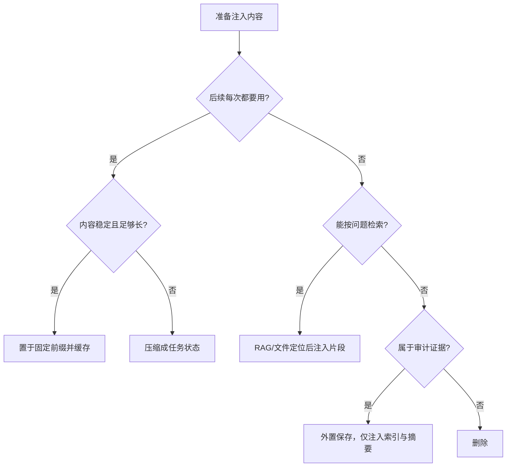

# 上下文窗口与 Token 机制

> 上下文窗口不是“模型记忆”，而是一次推理可访问的工作集。生产系统真正要管的是：**预算、位置、缓存、压缩和可观测性**。

## 1. Token 与上下文预算

Token 是 tokenizer 对输入切分后的离散 ID，不等于字符或单词。代码、JSON、URL、中文、空白的切分效率不同；同一段文本换模型后 token 数也可能变化。任何按“字数×固定系数”估算的方案都只能用于容量预警，计费与硬门禁必须调用厂商 token-count API 或对应 tokenizer。

单次调用的基本约束：

```text
input_tokens + cached_prefix_tokens + retained_thinking_tokens
+ reserved_output_tokens <= model_context_limit
```

注意：缓存 token 仍占上下文，只是减少重复前向计算和费用；reasoning/thinking 是否占窗口、是否在多轮中保留，取决于模型与 API。不要把 `max_tokens` 当成“只限制可见答案”的通用规则。

### 1.1 2026 主流窗口：能力必须运行时发现

| 模型族（2026-08） | 典型上下文 | 典型最大输出 | 工程备注 |
|---|---:|---:|---|
| Claude Opus 5 / Sonnet 5 / 4.6 | 1M | 128K | 新一代 Opus/Sonnet 默认 1M；旧 Sonnet/Haiku 不能套用 |
| Gemini 3.6 Flash / 3.5 Flash-Lite | 1M | 64K | SDK `models.get` 可读 input/output token limit |
| OpenAI GPT-5.6 系列 | 以 Models API 为准 | 以 Models API 为准 | 缓存策略已引入显式 breakpoint 与 cache-write 计费 |

**红线**：不要在业务代码里维护“模型名→窗口大小”静态表。模型别名、preview、云平台托管版本会漂移。启动时读取模型元数据；读取失败则使用配置中的保守上限并报警。

官方依据：
- [Anthropic Context windows](https://docs.anthropic.com/en/docs/build-with-claude/context-windows)
- [Gemini Token guide](https://ai.google.dev/gemini-api/docs/tokens)
- [OpenAI Prompt caching](https://developers.openai.com/api/docs/guides/prompt-caching)

## 2. 长上下文不等于有效上下文

模型能接收 1M token，不代表 1M token 都能被稳定检索和推理。主要退化来自：

1. **位置效应**：关键证据被埋在中部，命中率低于开头/结尾。
2. **干扰效应**：相似但错误的候选越多，模型越容易错误归因。
3. **任务稀释**：指令、工具说明、历史消息和资料争夺注意力。
4. **输出挤压**：输入装满后没有足够的答案或 thinking 预算。
5. **延迟放大**：超长 prefill 增加 TTFT；缓存未命中时尤其明显。

因此应把上下文当成分层缓存，而不是无限日志：

| 层级 | 放什么 | 失效策略 |
|---|---|---|
| L0 固定前缀 | system、稳定工具 schema、安全规则 | 版本变更才失效，优先 prompt cache |
| L1 任务状态 | 当前目标、约束、计划、已验证事实 | 每轮重写为短状态快照 |
| L2 工作证据 | 当前步骤真正需要的代码、文档片段 | 检索后注入，带来源与范围 |
| L3 冷历史 | 完整日志、旧工具输出、大附件 | 外置存储，按需检索，不直接回灌 |

### 2.1 决策树



## 3. Prompt Caching：缓存的是前缀，不是答案

Prompt cache 复用相同 prompt 前缀的 KV 计算。模型仍会生成新答案，随机调用不会因缓存而变成确定性调用。

### 3.1 三家机制对比

| 平台 | 命中方式 | TTL/存续 | 关键观测字段 |
|---|---|---|---|
| Anthropic | 自动缓存或内容块 `cache_control` breakpoint | 默认 5 分钟，可选 1 小时 | `cache_read_input_tokens`、`cache_creation_input_tokens` |
| OpenAI | 相同前缀；GPT-5.6+ 推荐 `prompt_cache_key` 与显式 breakpoint | GPT-5.6+ 至少 30 分钟可复用 | `cached_tokens`、`cache_write_tokens` |
| Gemini | 2.5+ 隐式缓存；也可创建显式 cached content | 显式缓存默认 1 小时，可设 TTL | `usage_metadata` 中 cached tokens |

共同原则：**静态内容放前，动态内容放后**。时间戳、随机 ID、用户输入不能插入静态前缀中间；工具列表或 JSON Schema 改动也可能使后续前缀失配。

### 3.2 生产示例一：Anthropic 自动缓存与指标

```python
import anthropic
from dataclasses import dataclass

client = anthropic.Anthropic()
SYSTEM = """你是代码审计器。以下规则和 CWE 映射固定不变……"""

@dataclass
class CacheMetrics:
    created: int
    read: int

def review(diff: str) -> tuple[str, CacheMetrics]:
    if not diff.strip():
        raise ValueError("diff 不能为空")
    response = client.messages.create(
        model="claude-sonnet-5",
        max_tokens=4000,
        cache_control={"type": "ephemeral", "ttl": "1h"},
        system=SYSTEM,
        messages=[{"role": "user", "content": diff}],
    )
    usage = response.usage
    metrics = CacheMetrics(
        created=getattr(usage, "cache_creation_input_tokens", 0),
        read=getattr(usage, "cache_read_input_tokens", 0),
    )
    text = "".join(b.text for b in response.content if b.type == "text")
    return text, metrics
```

验收不是“请求成功”，而是连续相同前缀调用后 `read > 0`。若一直只有 cache write：检查前缀是否含时间戳、工具顺序是否变化、请求间隔是否超过 TTL。

### 3.3 生产示例二：.NET 上下文预算门禁

```csharp
public sealed record ContextBudget(
    int Limit, int ReservedOutput, int SafetyMargin,
    int SystemTokens, int HistoryTokens, int EvidenceTokens)
{
    public int Used => SystemTokens + HistoryTokens + EvidenceTokens;
    public int Available => Limit - ReservedOutput - SafetyMargin;
    public bool IsSafe => Used <= Available;
}

public static ContextBudget BuildBudget(
    int modelLimit, int systemTokens, int historyTokens,
    int evidenceTokens, int reservedOutput = 8_000)
{
    if (modelLimit <= 0) throw new ArgumentOutOfRangeException(nameof(modelLimit));
    var margin = Math.Max(2_000, (int)(modelLimit * 0.05));
    var budget = new ContextBudget(modelLimit, reservedOutput, margin,
        systemTokens, historyTokens, evidenceTokens);
    if (!budget.IsSafe)
        throw new InvalidOperationException(
            $"Context overflow: used={budget.Used}, available={budget.Available}");
    return budget;
}
```

真实管线应在门禁失败后依次执行：删除旧工具原文 → 压缩历史为状态快照 → 缩小 RAG top-k → 降低保留输出预算（仅当产品允许），而不是静默截断头部。

## 4. 压缩与 Compaction

长会话至少需要两类压缩：

- **语义压缩**：把历史重写为目标、约束、决策、未决项、验证结果、文件路径；适合 Agent handoff。
- **机械裁剪**：删除大段工具输出、重复文档和已完成步骤；适合紧急止血。

合格状态快照必须保留：

```yaml
goal: 当前最终目标
constraints: [不可违反的边界]
decisions: [结论及理由]
verified_facts: [带来源的事实]
artifacts: [文件路径、URL、对象ID]
open_issues: [尚未解决的问题]
next_action: 唯一下一步
```

压缩后必须做“可恢复性测试”：新 worker 只拿快照和产物索引，能否继续执行且不重复已完成副作用。不能恢复的摘要只是文案，不是状态。

## 5. Token 成本与容量计算

一次请求成本可拆为：

```text
Cost = uncached_input × input_rate
     + cache_write × write_rate
     + cache_read × read_rate
     + output × output_rate
```

优化顺序：

1. 先减少无效输出，因为输出通常更贵。
2. 再稳定 prompt 前缀，提高缓存命中。
3. 再裁掉重复历史与工具输出。
4. 最后才考虑缩短字段名、CSV 等微优化；可维护性通常比几十个 token 更值钱。

### 5.1 每次发布必须记录的指标

- `input_tokens / output_tokens / reasoning_tokens`
- `cached_tokens / cache_write_tokens`
- 上下文占用率 P50/P95/P99
- 首 token 延迟 TTFT、完整延迟
- compaction 次数与压缩前后 token 比
- 因上下文溢出导致的 retry/失败数
- 单任务 token 成本，而非单请求成本

## 6. 常见错误

- ❌ “1M 窗口就把整个仓库塞进去” → 干扰、延迟、成本同时上升。
- ❌ 用字符数硬门禁 → tokenizer 与多模态 token 会让估算偏离。
- ❌ 缓存命中后以为不占窗口 → 缓存只省计算/费用，不扩容。
- ❌ 动态内容放在前缀中间 → 后续长前缀全部 cache miss。
- ❌ 只摘要自然语言、不保留产物句柄 → 会话无法恢复。
- ❌ 静默截断最早消息 → system 约束或关键决策可能被删。

## 关联知识
- [[1.1-大模型演进与主流架构体系]]
- [[2.1-系统提示词与角色设定]]
- [[2.3-结构化数据输出]]
- [[3.3-RAG系统架构与演进]]
- [[4.3-记忆机制设计]]

## 更新日志
| 日期 | 更新内容 |
|---|---|
| 2026-04-08 | 初始骨架创建 |
| 2026-04-14 | 补充 Token、上下文、计费与 Prompt Caching 基础 |
| 2026-08-11 | 按 2026 官方文档重写：移除待验证模型表；补分层上下文、三厂缓存机制、预算决策树、Anthropic 与 .NET 生产示例、compaction 状态规范和观测指标 |
