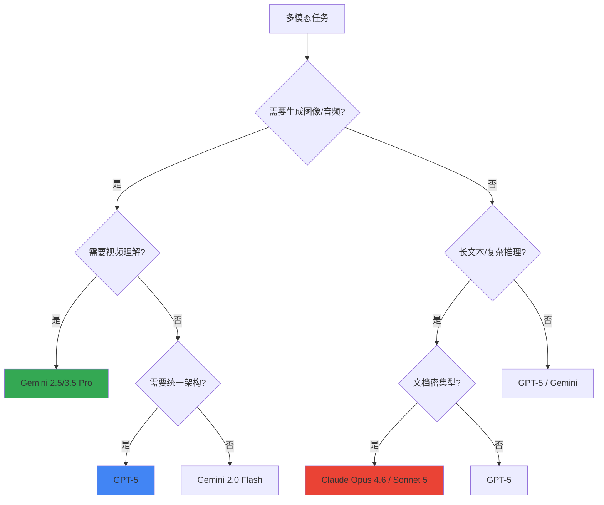

# 多模态能力原理与应用

> [!note] 说明
> 本文档为小贝知识库自动整理和排版。多模态是 2024-2026 年最热的能力演进方向，从"看图说话"到"原生图像生成"，变化巨大。

## 核心概念

多模态（Multimodal）指模型能处理和生成**多种数据模态**——文本、图像、音频、视频。

> [!tip] .NET 类比
> 传统 LLM 就像一个只接受 `string` 参数的 Web API。多模态模型则升级成了接受 `MultipartFormData` 的 API——你可以同时 POST 文本、图片、音频文件，它能统一理解并返回混合格式响应。

### 多模态的两种实现路径

| 路径 | 原理 | 代表 | 类比 |
| :--- | :--- | :--- | :--- |
| **桥接式（Bridge）** | 用独立编码器将非文本模态转为 Token 嵌入，注入 LLM | 早期 GPT-4V, LLaVA | 像 SQL Server 的 Linked Server——通过桥接器访问异构数据源 |
| **原生式（Native）** | 预训练阶段就在多模态数据上联合训练 | GPT-4o, Gemini 2.0/2.5 | 像 SQL Server 2016+ 的内置 JSON 支持——原生理解，无需转换 |

原生多模态是当前的主流趋势，效果和效率都远超桥接式。

## 各模型多模态能力矩阵（2026.08 最新）

### 输入能力

| 能力 | Claude 4/4.5 | GPT-5 | Gemini 2.5/3.5 Pro | LLaMA 4 Scout |
| :--- | :--- | :--- | :--- | :--- |
| 文本输入 | ✅ | ✅ | ✅ | ✅ |
| 图像输入 | ✅（业界最强文档理解） | ✅ | ✅ | ✅ |
| PDF 输入 | ✅（原生，混合文档首选） | ✅ | ✅ | ✅ |
| 音频输入 | ❌ | ✅（原生，统一模态） | ✅（原生） | ⚠️（需集成） |
| 视频输入 | ❌ | ✅（帧采样） | ✅（**原生视频理解**，时序推理领先） | ⚠️（实验性） |

### 输出能力

| 能力 | Claude 4/4.5 | GPT-5 | Gemini 2.5/3.5 | Flux/SD |
| :--- | :--- | :--- | :--- | :--- |
| 文本输出 | ✅ | ✅ | ✅ | ❌ |
| 图像生成 | ❌ | ✅（**2025.08 原生统一**，不再依赖 DALL-E） | ✅（原生，2024.12） | ✅ |
| 音频/语音输出 | ❌ | ✅（原生实时，<300ms 延迟） | ✅ | ❌ |
| 视频生成 | ❌ | Sora（独立模型） | Veo 3（独立模型） | ❌ |

> [!warning] Claude 的多模态边界（2026.08）
> 截至 2026.08，Claude 系列（包括 Opus 4.6 和 Sonnet 4.5）**仍不支持图像/音频/视频生成**，也不支持音频/视频输入。Anthropic 战略聚焦在**文本推理深度**和**文档理解精度**（SWE-bench、长文本分析领先），放弃多模态生成的军备竞赛。Claude 的图像输入能力业界最强（PDF 混合文档、复杂图表、代码截图），但输出仅限文本。

> [!info] GPT-5 统一多模态架构（2025.08 发布）
> GPT-5 在 2025 年 8 月 7 日正式发布，是 OpenAI 首个**完全统一的多模态模型**：
> - **原生图像生成**：不再调用独立的 DALL-E 模型，文本和图像在同一推理路径中处理
> - **音频原生输入输出**：Realtime API 延迟降至 ~300ms，支持语音到语音的端到端对话
> - **自动推理路由**：API 自动判断任务复杂度，必要时切换到 "thinking mode"（类似 o3 的 CoT 模式）
> - **幻觉率降低 80%**（相比 GPT-4o），SWE-bench Verified 达到 74.9%（2026 年所有基础模型最高分）
> - 变体包括：`gpt-5`（标准）、`gpt-5-mini`（轻量）、`gpt-5-nano`（边缘）、`gpt-5-pro`（推理增强）

> [!info] Gemini 的视频理解领先优势
> Gemini 2.5/3.5 Pro 是 2026 年**唯一支持原生视频时序推理**的闭源模型：
> - 不是简单的帧采样，而是**理解视频中的运动、事件序列、因果关系**
> - 超长上下文（1M Token）可处理 1 小时以上视频（~700K Token）
> - 搭配 Google Workspace 原生集成（Drive、Docs、Sheets），企业文档工作流最低摩擦

## 关键技术进展（2024-2026）

### 1. GPT-5 统一多模态架构（2025.08）

OpenAI 在 2025 年 8 月 7 日发布 GPT-5，实现了**真正的统一多模态**：

- **原生图像生成**：不再依赖独立的 DALL-E 模型，文本和图像在同一推理路径中处理
- **音频原生输入输出**：支持语音到语音的端到端对话，Realtime API 延迟 <300ms
- **自动推理路由**：API 自动判断任务复杂度，必要时启用"thinking mode"（类似 o3 的 CoT）
- **幻觉率降低 80%**（相比 GPT-4o），数学准确率从 42.1% → 94.6%（AIME 2025）
- **持久化记忆**：跨会话记忆，不再局限于单次对话

**API 变体**：
- `gpt-5`：标准版（400K 上下文，272K 输入 + 128K 输出）
- `gpt-5-mini`：轻量版（成本优化）
- `gpt-5-nano`：边缘设备版
- `gpt-5-pro`：推理增强版（自动路由到 thinking mode）

> [!tip] 工程类比
> GPT-5 就像从"微服务架构（ASR + LLM + TTS + DALL-E 各自独立）"演进到"单体应用内置所有能力"——延迟降低、跨模态推理更连贯、成本更低（不用为每个模态单独付费）。

**工程影响**：
- **简化调用栈**：不再需要手动编排 Whisper（语音识别）→ GPT（推理）→ TTS（语音合成）→ DALL-E（图像生成）
- **降低延迟**：跨模态推理在单一模型内完成，省去模型间数据传输
- **统一计费**：所有模态按统一 Token 计费，不再分离定价

### 2. Gemini 原生多模态输出（2024.12）与视频理解领先优势

Google Gemini 2.0 Flash（2024.12）是首个同时支持**原生文本+图像+音频输出**的模型：

- **图像生成**：在对话流中直接生成、编辑图像
- **音频生成**：支持多语言、多音色的语音合成
- **混合输出**：一次响应中可以同时包含文本段落和图像

Gemini 2.5/3.5 Pro 进一步强化了这些能力，**视频理解**是 2026 年的核心差异化优势：

**视频理解能力对比**：

| 模型 | 视频能力 | 机制 | 上下文限制 |
| :--- | :--- | :--- | :--- |
| Gemini 2.5/3.5 Pro | **原生视频时序推理** | 视频 Token 化，理解运动、事件序列、因果关系 | 1M Token（支持 1 小时+） |
| GPT-5 | 帧采样理解 | 视频拆帧为图像序列，按图像处理 | 400K Token |
| Claude 4/4.5 | 不支持视频 | — | — |

> [!info] Gemini 的长视频优势
> 得益于超长上下文（1M Token），Gemini 可以处理 1 小时以上的视频内容。一小时视频约消耗 ~700K Token（包含视觉和音频 Token）。**时序推理**意味着：
> - 理解动作的先后顺序（"在门关闭之前，谁进入了房间？"）
> - 识别因果关系（"爆炸是因为什么引起的？"）
> - 追踪长视频中的多线叙事（电影剧情分析、监控录像事件回溯）

**企业场景**：
- **监控视频分析**：自动识别异常事件、生成事件时间线
- **培训视频索引**：按语义检索视频片段（"讲解数据库索引优化的部分"）
- **媒体内容审核**：理解视频上下文，而非单帧判断（避免误杀）

### 3. Claude 的文档理解与 Computer Use 深化（2024-2026）

Anthropic 在多模态路线上选择了**专注深度而非广度**的策略：

#### Claude 4/4.5 系列（2026.02-07）
- **Opus 4.6**（2026.02.05）：引入 Agent Teams（多 Agent 协作）、PowerPoint 集成
- **Sonnet 4.6**（2026.02.17）：企业级文档处理优化
- **Sonnet 5**（2026.07.24）：最智能的 Sonnet 版本，代码能力和专业工作场景表现顶级

**核心优势**：
- **文档理解精度**：PDF 混合文档（文字+表格+图表+代码截图）处理业界最强
- **长文本推理**：200K 上下文 + 卓越的信息压缩能力（SWE-bench、长合同分析领先）
- **代码能力**：Sonnet 5 在代码补全、重构、调试任务上持续领先 GPT-5 和 Gemini

**Computer Use 演进**（2024.10 首次发布）：

Claude 3.5 Sonnet (2024.10) 推出 **Computer Use**——模型能直接控制电脑桌面：

1. 截取屏幕截图
2. 理解 UI 元素位置（按钮、输入框、菜单）
3. 模拟鼠标点击和键盘输入
4. 循环执行直到任务完成

> [!tip] .NET 类比
> Computer Use 就像是一个 AI 驱动的 **Selenium WebDriver**，但不是针对浏览器，而是针对整个操作系统桌面。它通过"看截图→推理→操作"的 [[10-知识库/AI模型与Agent/04-智能体架构与工作流设计/4.1-AI_Agent核心心智模型.md|ReAct 循环]] 来执行任务。

**2026 年的工程应用**：
- **自动化测试**：在真实桌面环境中测试 GUI 应用（不依赖 Selenium/Playwright 的 HTML 假设）
- **跨应用数据迁移**：从遗留系统（没有 API 的 ERP/CRM）中提取数据
- **RPA 增强**：用自然语言描述流程，Claude 自动操作桌面应用完成任务

### 4. 实时语音对话（Realtime API）

OpenAI 2024 年推出的 Realtime API，在 GPT-5（2025.08）中达到生产级别：
- **语音到语音**的端到端处理（不经过 ASR→LLM→TTS 的传统管道）
- 延迟降至 **~300ms**，接近人类对话节奏
- 支持打断、情绪感知、多轮上下文记忆

**工程优势**：
- **低延迟**：省去转录和合成的中间步骤，语音直接输入模型核心
- **保留韵律信息**：音调、停顿、情绪在推理过程中被保留（传统 ASR 会丢失）
- **自然打断**：用户可以在 AI 说话时打断，AI 立即停止并响应新输入

**2026 年应用场景**：
- **客服热线**：替代传统 IVR 系统，支持自然对话式导航
- **语音助手**：家庭/车载场景的对话式控制（Apple CarPlay、Android Auto 集成）
- **教育陪练**：语言学习、面试模拟（实时纠音、语速调节）

## 2026 年多模态选型决策树



**选型规则**：
1. **需要视频时序推理** → Gemini 2.5/3.5 Pro（唯一原生支持）
2. **需要统一多模态生成**（文本+图像+音频） → GPT-5（最低调用成本）
3. **文档理解+长文本推理** → Claude Opus 4.6 / Sonnet 5（PDF/合同/代码分析最强）
4. **成本敏感的多模态** → Gemini 2.0 Flash（性价比首选）
5. **纯文本深度推理** → Claude Sonnet 5（代码/逻辑/数学领先）

## 多模态工程最佳实践

### 图像输入优化

```python
# Claude Vision API 示例
message = client.messages.create(
    model="claude-4-sonnet-20250514",
    max_tokens=1024,
    messages=[{
        "role": "user",
        "content": [
            {
                "type": "image",
                "source": {
                    "type": "base64",
                    "media_type": "image/png",
                    "data": base64_image
                }
            },
            {
                "type": "text",
                "text": "分析这个架构图中的数据流向"
            }
        ]
    }]
)
```

> [!warning] 图像 Token 消耗
> 图像输入会被转换为 Token，消耗量与分辨率成正比。一张 1568x1568 的图像在 Claude 中约消耗 ~1600 Token。建议：
> 1. 下采样到必要的最小分辨率
> 2. 裁剪无关区域
> 3. 多张小图比一张大图更高效

## 关联知识
- [[10-知识库/AI模型与Agent/01-基础架构与模型底座/1.1-大模型演进与主流架构体系.md]]
- [[10-知识库/AI模型与Agent/01-基础架构与模型底座/1.2-上下文窗口与Token机制.md]]
- [[10-知识库/AI模型与Agent/04-智能体架构与工作流设计/4.1-AI_Agent核心心智模型.md]]
- [[10-知识库/AI模型与Agent/06-工程落地与Vibe_Coding实战/6.1-终端IDE形态深度对比.md]]

## 更新日志
| 日期 | 更新内容 |
| :--- | :--- |
| 2026-04-08 | 初始骨架创建 |
| 2026-04-14 | 全面填充：多模态实现路径（桥接式 vs 原生式）、各模型能力矩阵、GPT-4o 原生图像生成、Gemini 原生多模态输出、视频理解、Computer Use、Realtime API、工程最佳实践 |
| 2026-08-04 | **周度深度丰富**：更新 2026.08 最新多模态能力矩阵（GPT-5、Claude 4/4.5、Gemini 3.5、LLaMA 4）；补充 GPT-5 统一架构详细信息（2025.08 发布）；深化 Gemini 视频时序推理优势与企业场景；补充 Claude Sonnet 5（2026.07）与 Computer Use 工程应用；扩展 Realtime API 工程优势与 2026 应用场景；新增 2026 多模态选型决策树 |
