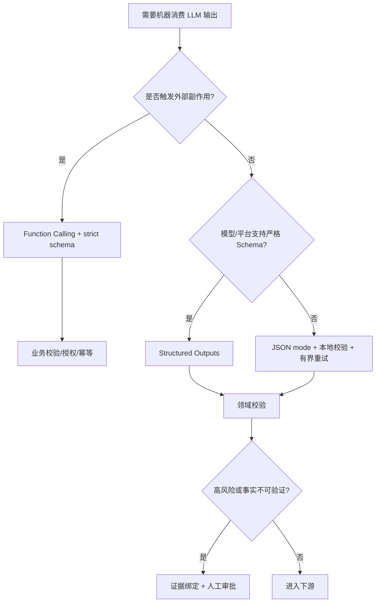

# 结构化数据输出

> 结构化输出解决“语法与形状”，不解决“事实与业务语义”。Schema 合规只能证明 JSON 可解析、字段类型正确，不能证明值真实。

## 1. 四层可靠性模型

把 LLM 输出直接反序列化为对象，只完成了最内层校验：

| 层级 | 保证 | 典型手段 | 失败例子 |
|---|---|---|---|
| L1 语法 | 是合法 JSON | JSON mode | JSON 合法但缺字段 |
| L2 结构 | 匹配 JSON Schema | Structured Outputs / constrained decoding | `amount=-1` 仍可能合规 |
| L3 业务 | 满足领域不变量 | 应用层 validator、数据库约束 | 发票合计与明细不一致 |
| L4 事实 | 值可追溯且正确 | 检索证据、引用、人工复核 | 模型虚构合同编号 |

生产系统至少要做到 L2+L3。涉及付款、删库、权限或外发时，必须增加 L4 证据和 Human-in-the-loop。

## 2. JSON Mode、Structured Outputs 与 Function Calling

| 方案 | 主要目标 | Schema 保证 | 应用场景 |
|---|---|---|---|
| JSON mode | 输出合法 JSON | 否 | 旧模型兼容、低风险文本转换 |
| Structured Outputs | 最终答案符合 Schema | 是（支持子集内） | 抽取、分类、API 响应、报表 |
| Function Calling | 让模型请求执行动作 | strict 模式可保证参数形状 | 查库、写文件、调用业务 API |
| Grammar/regex | 自托管模型约束 token | 取决于 grammar | vLLM/SGLang、本地模型、DSL |

关键区别：**Structured Outputs 是“回答长什么样”，Function Calling 是“程序下一步做什么”**。不要把纯信息抽取伪装成工具，也不要让模型输出一句“请执行付款”替代受控工具调用。



## 3. 约束解码原理

普通采样在每一步从完整词表选择 token。约束解码先把 JSON Schema 编译为 grammar/automaton，再根据当前状态把非法 token 的概率 mask 掉：

```text
logits(model) -> grammar_allowed_tokens(state)
              -> mask invalid logits to -∞
              -> sample valid token
              -> advance grammar state
```

它能消灭缺引号、非法 enum、漏 required 字段等**结构错误**，但无法阻止模型在合法 `string` 中编造内容。

### 3.1 工程代价

- 首次使用新 Schema 可能产生 grammar 编译延迟；稳定 schema 应版本化并预热。
- Schema 越深、分支越多、enum 越大，编译和解码开销越高。
- 各平台只支持 JSON Schema 子集；不要从 Draft 2020-12 全量特性倒推 API 能力。
- 属性顺序通常按 schema 输出；不要依赖模型自行调整顺序。
- `additionalProperties: false` 是严格模式常见要求，也是防止模型偷偷扩展字段的安全边界。

自托管场景常见引擎为 XGrammar、Outlines、Guidance、lm-format-enforcer；选型应以目标版本的 vLLM/SGLang 集成和基准为准，不写死“某后端永远默认或永远最快”。

## 4. 2026 厂商 API 能力

| 平台 | 最终 JSON | 严格工具参数 | SDK 类型映射 | 重要限制 |
|---|---|---|---|---|
| OpenAI | `response_format/json_schema` 或 SDK parse | strict function schema | Pydantic、Zod 等 | 仅支持 Schema 子集；推荐优先 Structured Outputs 而非 JSON mode |
| Anthropic | `output_config.format` | `strict: true` | Python/Pydantic、TS/Zod、Java/C# 等 | JSON output 与 citations、message prefill 不兼容 |
| Gemini | `response_format` + `application/json` + schema | Function Calling | Pydantic、Zod | 支持 JSON Schema 子集；Structured Outputs 用于最终格式 |

官方依据：
- [OpenAI Structured Outputs](https://developers.openai.com/api/docs/guides/structured-outputs)
- [Claude Structured Outputs](https://platform.claude.com/docs/en/build-with-claude/structured-outputs)
- [Gemini Structured Outputs](https://ai.google.dev/gemini-api/docs/structured-output)

Anthropic 已将旧 beta 的 `output_format` 迁移为 `output_config.format`。官方明确说明：JSON outputs 与 `strict: true` 工具可以独立或组合；grammar 只约束 Claude 的直接输出，不约束 thinking、tool result 等其他区段。

## 5. Schema 设计规范

### 5.1 把语义约束写进类型，而不是 prompt

```json
{
  "type": "object",
  "additionalProperties": false,
  "properties": {
    "decision": {
      "type": "string",
      "enum": ["approve", "reject", "manual_review"]
    },
    "confidence": {"type": "number", "minimum": 0, "maximum": 1},
    "evidence_ids": {
      "type": "array",
      "items": {"type": "string"},
      "minItems": 1
    },
    "reason": {"type": "string"}
  },
  "required": ["decision", "confidence", "evidence_ids", "reason"]
}
```

正确：有限状态用 `enum`，ID 与展示文本分离，拒绝额外属性。
错误：所有字段都定义为 `string`，再在 prompt 里写“confidence 必须 0 到 1”。

### 5.2 Schema 是公开接口

- 使用稳定 `schema_name` 与语义版本，例如 `invoice_extract.v2`。
- 新增 required 字段属于 breaking change；先增加 optional，再迁移消费者。
- property 名不能包含客户隐私、PHI、密钥或动态业务值。Anthropic 明确提示 grammar/schema 缓存的保护边界与消息内容不同。
- 描述写语义，不塞大段 few-shot；大例子放 prompt，schema 只保留约束。
- 避免 8 层嵌套和巨大 union；拆成分阶段抽取通常更稳、更易评测。

## 6. 生产示例一：.NET 双层校验与证据门禁

```csharp
using System.ComponentModel.DataAnnotations;
using System.Text.Json;
using System.Text.Json.Serialization;

public sealed record InvoiceResult(
    [property: Required] string InvoiceNo,
    DateOnly InvoiceDate,
    decimal NetAmount,
    decimal TaxAmount,
    decimal GrossAmount,
    IReadOnlyList<string> EvidenceIds);

public static class InvoiceValidator
{
    public static InvoiceResult ParseAndValidate(string json, ISet<string> allowedEvidence)
    {
        var options = new JsonSerializerOptions
        {
            PropertyNameCaseInsensitive = false,
            UnmappedMemberHandling = JsonUnmappedMemberHandling.Disallow
        };
        var value = JsonSerializer.Deserialize<InvoiceResult>(json, options)
            ?? throw new JsonException("LLM returned null");

        if (string.IsNullOrWhiteSpace(value.InvoiceNo))
            throw new ValidationException("InvoiceNo is required");
        if (value.NetAmount < 0 || value.TaxAmount < 0)
            throw new ValidationException("Amounts cannot be negative");
        if (Math.Abs(value.NetAmount + value.TaxAmount - value.GrossAmount) > 0.01m)
            throw new ValidationException("GrossAmount mismatch");
        if (value.EvidenceIds.Count == 0 || value.EvidenceIds.Any(id => !allowedEvidence.Contains(id)))
            throw new ValidationException("Evidence is missing or forged");
        return value;
    }
}
```

这里 LLM Schema 负责字段形状，`InvoiceValidator` 负责金额不变量，`allowedEvidence` 防止模型虚构不存在的证据 ID。三者缺一不可。

## 7. 生产示例二：Python 有界修复与失败分流

严格输出仍可能因 refusal、截断、网络错误而没有业务对象。重试必须分类，不能无脑重放：

```python
from typing import Literal
from pydantic import BaseModel, Field, ValidationError

class Ticket(BaseModel):
    category: Literal["billing", "security", "technical", "other"]
    priority: Literal["p0", "p1", "p2", "p3"]
    summary: str = Field(min_length=5, max_length=300)
    source_ids: list[str] = Field(min_length=1, max_length=20)

class PermanentOutputError(Exception):
    pass


def validate_ticket(raw_json: str, known_sources: set[str]) -> Ticket:
    try:
        ticket = Ticket.model_validate_json(raw_json)
    except ValidationError as exc:
        raise PermanentOutputError(f"schema validation failed: {exc}") from exc

    unknown = set(ticket.source_ids) - known_sources
    if unknown:
        raise PermanentOutputError(f"unknown source ids: {sorted(unknown)}")
    if ticket.priority == "p0" and ticket.category not in {"security", "technical"}:
        raise PermanentOutputError("p0 requires security/technical category")
    return ticket
```

调用层策略：

- 429/5xx/连接中断：指数退避，最多 2-3 次。
- 输出截断：增加输出预算或缩小任务，不沿用残缺 JSON 修补。
- refusal：转人工，不要求模型“忽略安全限制”。
- Schema 不支持/400：部署错误，立即失败并报警，不重试。
- 业务校验失败：可做一次带明确错误的 repair；再次失败进入 dead-letter queue。

## 8. Function Calling 的安全闭环

合法参数不等于允许执行。工具执行器必须独立完成：

1. **身份与授权**：当前用户是否能调用该工具、访问该资源。
2. **参数收紧**：SQL 只读、路径 allowlist、金额/收件人上限。
3. **幂等**：使用业务 idempotency key，避免 retry 重复付款或发信。
4. **审批**：不可逆、高金额、外部发布必须 HITL。
5. **审计**：保存 schema 版本、模型、原始 tool call、校验结果与执行回执。

```text
model tool_call
  -> JSON Schema validation
  -> domain validation
  -> authorization policy
  -> human approval (if required)
  -> idempotent executor
  -> immutable audit log
```

## 9. 测试与可观测性

结构化输出上线前至少建立以下测试集：

- 正常样本：常见输入覆盖。
- 边界样本：空值、超长文本、Unicode、极大/极小数字。
- 对抗样本：正文内含“忽略 Schema”、伪 JSON、prompt injection。
- 拒答样本：安全策略触发时消费者不会崩溃。
- 截断样本：`max_output_tokens` 不足时进入正确分流。
- Schema 兼容：旧消费者可否读取新版本输出。

关键指标：

- syntax/schema/domain/factual 四类失败率分开统计。
- 首次 Schema 编译延迟与稳态延迟。
- repair retry 率、dead-letter 数量。
- unknown enum、extra property、证据 ID 不存在的比例。
- 每个 schema 版本的准确率，而非只看 JSON parse success。

## 10. 常见反模式

- ❌ Prompt 里写“只输出 JSON”并用正则截取 `{...}`。
- ❌ 把 JSON mode 当作 Schema guarantee。
- ❌ `additionalProperties` 默认开放，导致悄悄出现未知字段。
- ❌ 只做反序列化，不做金额、日期、权限等领域校验。
- ❌ 模型给出的 URL、文件 ID、合同号直接视为真实。
- ❌ 每个请求动态生成新 Schema，造成编译延迟与缓存碎片。
- ❌ Schema 变更不版本化，消费者静默错读。

## 关联知识
- [[2.3.1-结构化输出-厂商能力对比]]
- [[2.3.2-结构化输出-工程实战]]
- [[3.1-函数调用底层机制]]
- [[3.2-Model_Context_Protocol规范解析]]
- [[4.4-Human-in-the-loop交接机制]]
- [[5.3-AI安全护栏与防御机制]]

## 更新日志
| 日期 | 更新内容 |
|---|---|
| 2026-04-08 | 初始框架创建 |
| 2026-04-14 | 补充厂商方案、约束解码、Function Calling 与 Semantic Kernel 示例 |
| 2026-07-28 | 更新 XGrammar、vLLM、SGLang 生态说明 |
| 2026-08-11 | 按三家官方文档重写：补四层可靠性模型、选型决策树、2026 API 形态、Schema 版本治理、.NET/Python 生产校验、工具安全闭环与可观测指标 |
