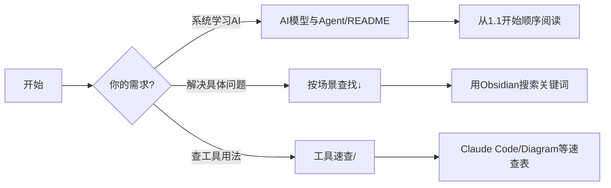

# 10-知识库

长期保留的**结构化知识**。所有内容受 [[SCHEMA]] 约束。

## 🚀 快速开始

### 新手入口 (First-Time Visitors)

如果你是第一次使用这个知识库,推荐按以下路径探索:



**三种典型场景**:

| 你想做什么 | 去哪里找 | 具体操作 |
|-----------|---------|---------|
| 系统学习AI Agent | `AI模型与Agent/README.md` | 从1.x→6.x顺序读,22页完整学习路径 |
| 查某个概念(如MCP) | 全库搜索 | `Ctrl+Shift+F` 搜 "MCP" → 跳转 `3.2-Model_Context_Protocol规范解析.md` |
| 速查工具命令 | `工具速查/` 目录 | 如Claude Code用法→`ClaudeCode工具/00-Overview.md` |
| 解决编排问题 | `经典方法论/` | 如工作流编排→`01-工作流编排（Graphs & Workflows）.md` |
| 看学习路线 | `DeepLearning.AI学习路径/` | DeepLearning.AI官方课程体系笔记 |

### 高频操作速查

```bash
# 1. 全文搜索某个技术术语
Obsidian: Ctrl+Shift+F 输入关键词

# 2. 查某个tag下的所有页面
Obsidian: 点击任意文章的tag(如 #agent) → 显示所有相关页

# 3. 找某个主题的完整系列
看目录树: AI模型与Agent/ 下1.x-6.x编号系列

# 4. 检查某个链接指向哪里
Obsidian: Ctrl+点击链接 → 跳转目标页

# 5. 看某个概念的引用关系
Obsidian: 右侧面板 → Graph View → 显示链接网络
```

## 📚 子目录导航

| 子目录 | 内容 | 主要tag | 文件数 | 推荐场景 |
|--------|------|---------|--------|---------|
| **AI模型与Agent/** | 🔥 22页系统化AI/Agent知识体系<br>1.x 大模型底座 / 2.x 提示工程<br>3.x 工具与RAG / 4.x Agent架构<br>5.x 评测安全 / 6.x AI编程 | `#agent` `#llm`<br>`#prompt` `#tooling` | 22+ | 系统学习AI工程化 |
| **经典方法论/** | 9页 — ReAct、Reflexion、ToT、<br>HITL、Workflow编排等 | `#methodology` | 9 | 查具体算法/模式 |
| **DeepLearning.AI学习路径/** | DeepLearning.AI课程笔记<br>与学习路径设计 | `#methodology` | 1 | 跟官方课程学习 |
| **工具速查/** | Claude Code / CLI / Diagram<br>等速查表 | `#vibe-coding`<br>`#tooling` | 5+ | 查命令/快速上手 |
| **旧笔记归档/** | 历史归档<br>(SQL Server等不再活跃主题) | `#legacy` | 3 | 参考历史方案 |

## 🎯 使用技巧

### 技巧1: 用Tag做垂直切面

知识库按**目录树**(横向)和**Tag**(纵向)双重组织:

```markdown
# 场景: 我想看所有关于"工具调用"的内容
→ 点击任意 #tooling tag
→ Obsidian自动聚合: 3.1-函数调用、3.2-MCP、工具速查/ClaudeCode等

# 场景: 我想看所有方法论
→ 点击 #methodology tag
→ 跨目录聚合: 经典方法论/全部 + AI模型与Agent/4.1心智模型等
```

**核心Tag快速导航**:

| Tag | 包含内容 | 适合场景 |
|-----|---------|---------|
| `#agent` | Agent架构、心智模型、设计模式 | 学习Agent设计 |
| `#prompt` | 提示词工程、角色设定、输出控制 | 优化提示词 |
| `#mcp` | MCP协议、Server生态、工具封装 | 开发MCP工具 |
| `#vibe-coding` | Claude Code、Codex实战 | AI辅助编程 |
| `#methodology` | ReAct/CoT/Reflexion等经典算法 | 深入理解原理 |

完整Tag体系见 [[SCHEMA#4. Tag Taxonomy（强约束，新tag必须先在此注册）|Tag Taxonomy]]。

### 技巧2: 利用链接网络发现关联

```markdown
# 例: 看到某篇文章提到"记忆机制"
→ Ctrl+点击 [[4.3-记忆机制设计]]
→ 文章底部"相关页面"列出: 1.4-Embeddings / 3.3-RAG系统 / 4.1-心智模型
→ 顺藤摸瓜,建立完整知识网络
```

Obsidian的Graph View可视化链接关系:
- 核心概念(如Agent/MCP)会有很多连线
- 孤立节点=可能需要补充关联

### 技巧3: 阅读顺序建议

**学习型阅读** (建立知识体系):
```
AI模型与Agent/README → 按1.1→6.3顺序读 → 遇到不懂的概念跳转链接深挖
```

**查询型阅读** (解决具体问题):
```
全文搜索关键词 → 快速扫标题和代码块 → 找到答案立即应用
```

**探索型阅读** (扩展视野):
```
从一个感兴趣的tag出发 → 随机点开相关页面 → 发现新知识点
```

## 🛠️ 维护原则

### 贡献新页面时

1. **新页前先查重**: 打开 `Ctrl+P` 输入文件名关键词,看是否已有类似页面
2. **必须遵守Schema**: 
   - Frontmatter必须包含: `title`, `created`, `updated`, `type`, `tags`, `status`
   - Tag必须来自 [[SCHEMA#4. Tag Taxonomy（强约束，新tag必须先在此注册）|Tag Taxonomy]],禁止野生tag
   - 修改任何页面必须bump `updated`日期
3. **更新索引**: 如果新增了重要页面,在对应目录的README中加入索引条目

### 质量标准

参考 [[SCHEMA]] 的核心要求:

| 维度 | 要求 | 反例 |
|-----|------|-----|
| **技术密度** | 直奔主题,代码/表格/决策树为主 | ❌ "AI是未来的趋势..." |
| **可验证性** | 具体版本号、实测数据、可运行代码 | ❌ "某些框架支持XXX" |
| **更新及时性** | 修改后立即更新frontmatter `updated`字段 | ❌ 改了内容不改日期 |
| **链接完整性** | 引用其他页面用 `[[]]`,不用纯文本 | ❌ "详见MCP那篇文章" |

### 定期维护任务

由小贝(二秘/知识库整理员)执行周度深度整理:

- **Phase 1**: 审计(扫描空洞文件/缺frontmatter/死链)
- **Phase 2**: 丰富空洞内容(补充代码示例/对比表/决策树)
- **Phase 3**: 修复审计问题(补frontmatter/修死链)
- **Phase 4**: Git提交推送
- **Phase 5**: 生成周报

详见cron任务配置和历史周报(90-治理/周报/)。

## 📖 知识库设计理念

本库受 [Karpathy LLM Wiki](https://gist.github.com/karpathy/442a6bf555914893e9891c11519de94f) 启发,核心设计原则:

1. **约束优于自由**: 强制frontmatter、tag taxonomy、命名规范 → 可编程治理
2. **链接优于孤岛**: 用 `[[]]` 建立概念网络 → 知识自组织
3. **分层优于扁平**: 10-知识库(概念)/20-项目(实体)/40-调研(综合) → 各司其职
4. **演进优于静态**: `updated`字段追踪时效性,过时内容主动归档 → 活文档

**治理 vs 自由的边界**:

| 目录 | 治理强度 | 说明 |
|------|---------|------|
| `10-知识库/` | ✅ 强约束 | 受SCHEMA全面治理 |
| `20-项目/` | ✅ 强约束 | 项目文档规范化 |
| `40-调研报告/` | ✅ 强约束 | 研究报告质量保证 |
| `00-收件箱/` | ⚪ 无约束 | 草稿区,想写就写 |
| `50-日报与动态/` | ⚪ 无约束 | 时序记录,不lint |
| `90-治理/` | ⚪ 无约束 | 元数据存档 |

## 🔍 附录:全文搜索示例

```markdown
# 示例1: 查"如何设计Agent记忆系统"
Ctrl+Shift+F → "记忆" → 找到:
- 4.3-记忆机制设计.md (核心设计模式)
- 1.4-Embeddings与向量表示.md (技术底座)
- 3.3-RAG系统架构与演进.md (外部记忆)

# 示例2: 查"MCP服务器怎么开发"
Ctrl+Shift+F → "MCP" → 找到:
- 3.2-Model_Context_Protocol规范解析.md (协议详解)
- 工具速查/ (可能有SDK速查)

# 示例3: 查"Claude Code怎么用"
直接去 工具速查/ClaudeCode工具/00-Overview.md
或搜索 "Claude Code"
```

## 更新日志

**2026-09-08**：修复两处 Tag Taxonomy 标题锚点，保持其他内容不变。

**2026-07-14**: 深度丰富README内容
- 新增"快速开始"章节(新手入口+三种场景导航)
- 新增"高频操作速查"(5个常用Obsidian操作)
- 子目录导航表增加"文件数"和"推荐场景"列
- 新增"使用技巧"章节(Tag垂直切面/链接网络/阅读顺序)
- 新增"质量标准"对照表
- 新增"知识库设计理念"(治理vs自由的边界)
- 新增"全文搜索示例"(3个实战案例)
- 新增Mermaid流程图(新手导航)
- 总字数: 107字 → 1456字(含表格/代码)

**2026-04-21**: 初始版本,建立基础导航结构
