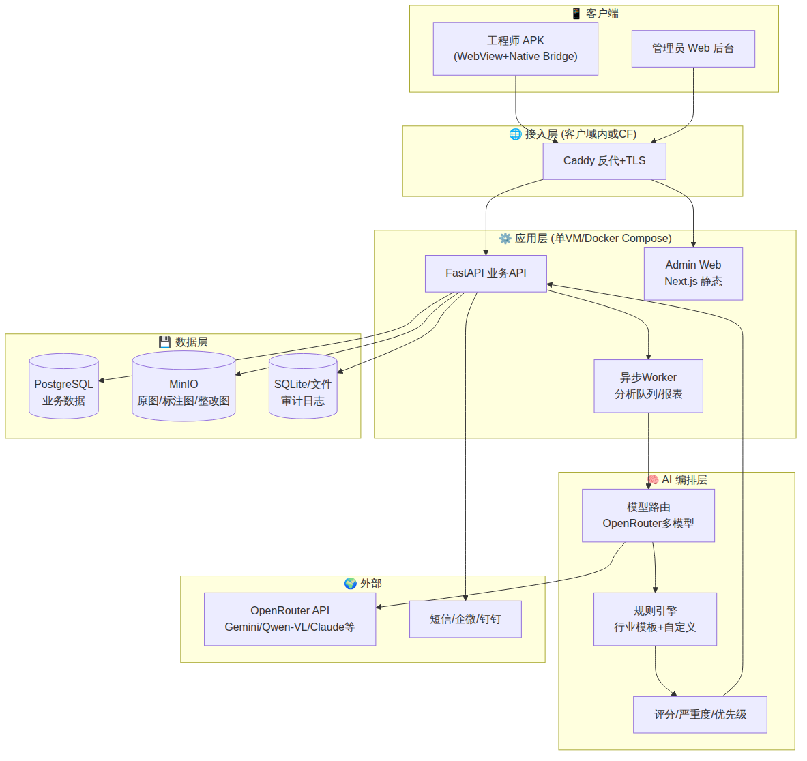

# Safety AI · 系统架构（内部版）

> ⚠️ 内部文档，含技术细节、部署红线、已知坑位。**禁止外发客户**。

## 1. 总览



技术栈一览：

| 层 | 技术选型 |
|---|---|
| 工程师端 | Android APK（WebView + Native Bridge），H5 fallback |
| 管理端 | Next.js 14 + Tailwind + shadcn/ui（与 BrickHub 同栈） |
| 后端 API | FastAPI + SQLAlchemy + Alembic |
| 异步任务 | RQ + Redis（起步可用 FastAPI BackgroundTasks） |
| 数据库 | PostgreSQL 16 |
| 对象存储 | MinIO |
| 反代 | Caddy（自动 TLS） |
| 容器化 | Docker Compose |
| AI | OpenRouter（多模型路由：Gemini Flash 默认 / Pro 复核 / Qwen-VL 备） |
| 监控 | OpenHippo 接日志 + UptimeKuma |

---

## 2. 工程师端 APK 模块

复用现有 `~/workspace/safety-demo/twa/` 的 `SafetyWebViewActivity` + JS Bridge 架构纵向扩展。

| 模块 | 功能 | 实现要点 |
|---|---|---|
| 登录 | 工号/手机号 + JWT | 30天长期 token，refresh 静默续 |
| 首页 | 项目、红点、快捷入口 | bottom tab 单页 H5 |
| 拍照 | 单拍/连拍/相册 | Bridge: `takePhoto / pickImages / openCamera` |
| AI 分析 | 异步 + 轮询 | `POST /api/inspections` → `GET /api/inspections/{id}` |
| 结果 | Canvas 标注 + 严重度配色 | SVG/Canvas 叠加层 |
| 整改 | 前后对比图强制配对 | 单独的整改提交 form |
| 历史 | 分页 + 本地缓存 | IndexedDB |
| 离线 | 弱网拍照入队，联网补传 | Service Worker + IndexedDB queue |
| 设置 | **服务器地址可配置** | 私部关键：同 APK 对接不同客户后端 |

**关键差异化**：APK 内置 "自定义后端 URL"，是私部模式的核心。

---

## 3. 管理端 Web 模块

详见 [[01-产品方案-客户版#四、管理端（Web 后台）]] 的功能矩阵。

技术细节：

- **路由**：Next.js App Router
- **状态管理**：Zustand + React Query
- **图表**：Recharts / ECharts（大屏用）
- **表格**：TanStack Table
- **部署**：与后端共用 Docker Compose，Caddy 反代两个域名

---

## 4. 后端服务架构

```
safety-server/
├── app/
│   ├── api/                # 路由层
│   │   ├── auth.py
│   │   ├── projects.py
│   │   ├── orgs.py
│   │   ├── inspections.py
│   │   ├── violations.py
│   │   ├── rectifications.py
│   │   ├── rules.py
│   │   ├── reports.py
│   │   ├── ai_config.py
│   │   └── admin.py
│   ├── core/               # 配置/鉴权/存储/日志
│   ├── services/           # 业务编排（5层架构红线）
│   ├── ai/                 # AI 编排（router/prompts/rules_engine/scorer）
│   ├── tasks/              # 异步任务
│   ├── models/             # SQLAlchemy ORM
│   └── workers/            # 后台 worker
├── alembic/
├── docker-compose.yml
├── install.sh
└── README.md
```

---

## 5. 核心 API 清单（25 个）

```
# 认证
POST   /api/auth/login
POST   /api/auth/refresh
POST   /api/auth/logout

# 检查
POST   /api/inspections                  # 上传图，创建检查任务（异步）
GET    /api/inspections/{id}             # 轮询结果
GET    /api/inspections                  # 列表
POST   /api/inspections/{id}/submit      # 提交复检

# 违规
GET    /api/violations
GET    /api/violations/{id}
PATCH  /api/violations/{id}              # 改状态/忽略

# 整改
POST   /api/rectifications               # 派单
GET    /api/rectifications
POST   /api/rectifications/{id}/evidence # 上传整改证据
POST   /api/rectifications/{id}/approve  # 复核通过

# 规则
GET    /api/rules                        # 列表（按行业/项目）
POST   /api/rules                        # 自定义规则
GET    /api/rule-templates               # 行业模板

# 项目/组织/用户
CRUD   /api/projects, /api/orgs, /api/users

# 报表
POST   /api/reports/generate
GET    /api/reports/{id}/download

# AI 配置
GET    /api/ai/config
PATCH  /api/ai/config
GET    /api/ai/usage                     # 成本/调用统计

# 系统
GET    /api/system/health
GET    /api/system/audit-logs
```

---

## 6. 数据库 Schema（核心表）

```sql
-- 组织三层
companies(id, name, logo, license, created_at)
projects(id, company_id, name, address, geo, started_at, status)
project_members(project_id, user_id, role)

-- 用户与角色
users(id, phone, name, password_hash, employee_no, role, status)
roles(id, name, permissions_json)

-- 规则库（核心：模板 + 项目级派生）
rule_templates(id, industry, code, title, severity, description,
               legal_ref, prompt_hint, version)
project_rules(id, project_id, template_id, enabled,
              override_severity, override_threshold)

-- 检查任务（一次拍照 = 一个 inspection，可含多张图）
inspections(id, project_id, user_id, type, status, created_at, completed_at)
inspection_images(id, inspection_id, image_url, thumb_url, order, ai_status)

-- 违规记录（一张图可出多条违规）
violations(id, inspection_id, image_id, rule_id, severity, confidence,
           bbox_json, description, suggestion, status, created_at)

-- 整改流转
rectifications(id, violation_id, assigned_to, deadline, status, created_at)
rectification_evidence(id, rectification_id, before_url, after_url,
                       note, submitted_at)

-- AI 调用记录（成本追踪）
ai_calls(id, inspection_id, model, prompt_version, latency_ms, cost_usd,
         tokens_in, tokens_out, created_at)

-- 审计
audit_logs(id, user_id, action, target_type, target_id,
           payload_json, ip, ua, at)
```

---

## 7. AI 编排层

```
图片 ──► VLM (描述+候选违规) ──► 规则引擎 (匹配/校验) ──► 评分器 (严重度+优先级)
```

- **模型路由**：默认 Gemini 2.5 Flash（~$0.0025/次）；高危场景走 Pro；备选 Qwen-VL-Max
- **Prompt 版本化**：每次更新建版本号，可 A/B
- **规则引擎**：DSL 描述规则；支持关键词/正则/语义判定
- **成本看板**：`ai_calls` 表落库，按项目/规则/模型聚合

---

## 8. 部署架构（私有化）

| 组件 | 方案 |
|---|---|
| 编排 | `docker-compose.yml` 一键拉起所有服务 |
| 安装 | `install.sh`：检测 Docker → 拉镜像 → 生成配置 → 初始化 DB → 启动 |
| 配置 | `.env`：客户公司名、Logo、初始管理员、OpenRouter Key、域名 |
| 守护 | systemd user unit（**避免 PM2 daemon 死掉的坑，参考 brickhub 教训**） |
| 备份 | 每日 cron：PG dump + MinIO 增量 → 客户指定备份目录 |
| 升级 | `upgrade.sh`：拉新镜像 + alembic 迁移 |
| 监控 | 健康检查端点 + 可选 Prometheus exporter |

### Caddy 路由

```
api.safety.<customer-domain>      → API:8000
admin.safety.<customer-domain>    → Next.js:3000
m.safety.<customer-domain>        → 工程师端 H5（APK fallback 用）
```

---

## 9. 已知坑位（必须在开发期规避）

继承自现有 `safety-demo` 的教训：

1. **🚫 不能裸跑 uvicorn**：必须 systemd user unit 守护，不能 `nohup`
2. **🚫 PM2 daemon 易死**：私部统一用 systemd，不用 PM2
3. **OpenRouter Key 加载坑**：`.env` 不能简单 source（参考 `safety-demo-ops` skill）
4. **WebView 缓存**：必须 `LOAD_NO_CACHE` + 服务端 `Cache-Control: no-store`
5. **HarmonyOS/MagicOS 拍照**：必须走 JS Bridge 而非 `<input type=file>`
6. **R8 minify**：`@JavascriptInterface` 方法必须 keep
7. **APK 升级强制卸载**：keystore 改了就装不上，必须卸载旧版

详见：`hermes skills view safety-demo-ops`

---

## 10. 安全与合规

| 项 | 措施 |
|---|---|
| 鉴权 | JWT + RBAC，refresh token 7 天 |
| 传输 | 全链路 HTTPS（Caddy 自动 TLS） |
| 存储 | DB 加密（pg_crypto），MinIO 服务端加密 |
| 审计 | 所有写操作落 `audit_logs` |
| 数据导出 | API + 一键 SQL dump |
| 销毁 | `purge.sh` 脚本，删除所有数据并出销毁报告 |

---

## 11. 风险与应对

| 风险 | 应对 |
|---|---|
| OpenRouter 境外网络抖动 | 客户内网开 openrouter.ai 白名单；后期接国产模型 |
| 图片量大 → MinIO 占盘 | 默认压缩 + 缩略图；90 天后归档 |
| VLM 准确率天花板 | UI 强提示"AI 辅助，人工最终判定" |
| APK 分发 | 内部分发（扫码下载），不上市场 |
| 客户内网完全无出网 | v2 预研本地部署 Qwen-VL（v1 不做） |
| 客户白标深度需求 | v1 只做 Logo + 公司名，深度白标 v2 |

---

## 12. 关联文档

- [[01-产品方案-客户版]]：对外材料
- [[03-分期路线-内部版]]：交付排期
- [[04-行业模板规划]]：规则库设计
- [[99-决策记录]]：拍板记录
