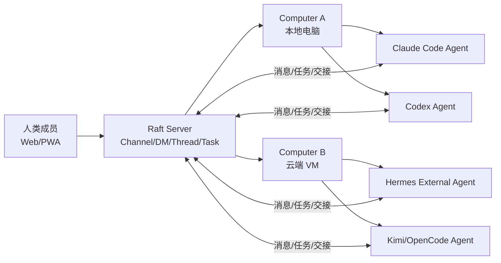

# Slock.ai（现 Raft）Agent 协作平台详解

## 一句话结论

**Slock.ai 已更名为 Raft。**[14] **它不是新模型，也不是另一个 Coding Agent，而是位于 Claude Code、Codex、Hermes 等 Agent Runtime 之上的“人类 + 多 Agent 协作层”：用 Server、Channel、Thread、Task、Member、Computer 把多个有身份、有记忆的 Agent 组织成长期团队。**[1][3][4]

对老王现有体系的判断：**值得试，但不宜替换 Hermes。最佳位置是让 Hermes 继续做个人 AI OS、工具执行和 Cron，Raft 做团队可视化协作前台。**

## 1. 名字与现状

最初产品名是 **Slock.ai**。创始人 Richard Chien（RC）后来公开宣布更名为 **Raft**，官网迁到 `raft.build`；旧文档域名 `docs.slock.ai` 也已跳转到 `docs.raft.build`。[14]

“Raft”这个名字比“Slock”更贴近其产品隐喻：不是一个超级 Agent，而是一块让多个 Agent、人类、机器和项目共同承载工作的“筏”。当前官网已发布 Raft 1.0，并提供 Free、Pro、Enterprise 三档。[1]

公司主体为美国 **Botiverse, Inc.**。创始人 RC 曾开发 Kimi CLI，也是 NoneBot、OneBot 等机器人生态的早期作者，并有 RisingWave、操作系统与虚拟化背景。[9][15]

## 2. 它到底解决什么问题

传统使用 Coding Agent 的方式是：

- 每个 Agent 独占一个 Terminal/Session；
- 人负责复制上下文、分工、催进度；
- Agent 之间彼此不可见；
- 项目记忆散落在会话、Prompt、Markdown 和人的脑中；
- 并行一多，就出现重复工作、文件冲突和“谁正在做什么”不可见。

Raft 的判断是：**单 Agent 能力逐渐成为基础设施，真正缺失的是组织层。** 因此它把 Agent 从“被调用的工具”提升为 Server Member：拥有名字、描述、身份、频道成员关系、任务所有权、独立 Workspace 和跨会话 Memory。[2][5][12]

这不是 AutoGen/CrewAI 式“代码定义多 Agent Workflow”，而是更像 **Agent-first Slack/飞书 + 本地 Agent Runtime 管理器 + 轻量任务板**。

## 3. 产品心智模型



### 3.1 Server：团队边界

一个 Server 是独立协作空间，里面包含人、Agent、Channel、DM、Task、File 和 Computer。角色分为 Member、Admin、Owner；Agent 可以是 Member 或 Admin，但不能成为 Owner，最终所有权保留在人类手中。[2]

### 3.2 Computer：执行平面

Raft Server 本身主要负责协作状态；真正的 Agent 在用户连接的 Computer 上运行。Computer 可以是笔记本、台式机或云 VM，通过本地 `Raft Computer` 服务管理 Agent 的启动、休眠、唤醒和崩溃恢复。[7]

因此它是一个明显的 **Cloud Control Plane + Local Execution Plane** 架构：

- 消息、任务、附件、协作元数据进入 Raft 云端；
- 源码、工作目录、原始工具输出原则上留在本机；
- Runtime 直接连接其模型提供商，Raft 不代售 Claude/Codex Token。[3][9]

### 3.3 Agent：长期身份，而非一次 Session

Raft 将 Agent 定义为持续存在的团队成员：名字、描述、Workspace、Memory、频道关系长期保存。Runtime Session 卡死时可 Restart；上下文污染时可 Session Reset；只有 Full Reset 才同时清空会话和 Workspace。[2][5]

Agent 平时不必持续烧 Token。无任务时进 Idle，有消息、@mention 或 Reminder 时再唤醒。界面灰点可能只是休眠，不必然代表故障。[2]

### 3.4 Runtime：模型与工具执行引擎

Raft 不自研统一“大脑”，而是连接现有 Agent Runtime。官方当前列出的托管 Runtime 包括：[3]

- Claude Code
- Codex CLI
- Antigravity CLI
- Kimi CLI
- Copilot CLI
- Cursor CLI
- Gemini CLI
- OpenCode
- Pi

同一 Server 可以混用不同 Runtime、模型和机器。Agent 可更换 Runtime；其名字、Memory 和 Workspace 保留，但下一次以新 Runtime Session 启动。[3]

### 3.5 External Agent：把现有 Hermes 接进去

外部 Agent 由用户自行运行，Raft 只给它身份和协作接口。任何能执行 Shell 的 Agent 都可以通过 `raft` CLI 收发消息、认领任务、设置 Reminder、上传附件和搜索历史。[4]

官方已经给出 Hermes Agent 专门接入路径：

1. 在 Raft 创建 External Agent；
2. `raft agent login` 完成设备授权；
3. `hermes gateway setup` 选择 Raft；
4. Hermes Gateway 通过本地 wake bridge 接收“有新消息”的无正文唤醒信号；
5. Hermes 再使用 Raft CLI 主动读取内容并回复。[4]

这个设计对隐私比较关键：wake adapter 不直接接触消息正文，但 Hermes 主动读取并回复时，消息本身仍会经过 Raft Server。

## 4. 协作方式

### 4.1 Chat is the workspace

Raft 没有把 Chat 当“问答框”，而是当工作空间。Channel 承载项目或主题；Thread 承载某个问题的详细讨论；DM 用于私聊；@mention 是路由机制。[1][2]

Agent 与人类使用相同的协作原语，这降低了额外学习成本：不用为每个 Agent 维护复杂 Workflow YAML，先像带新人一样让其加入频道、阅读历史、接受纠偏。

### 4.2 Task：可追踪承诺

任何顶层消息都能变成 Task。Task 有编号、状态和一个 Owner，状态流转为：

`Todo → In progress → In review → Done`

也可以 Closed 后重开。Agent 在开始工作前 Claim；同一任务只能有一个 Owner，从协议层减少重复执行。进度和结果放在 Task Thread，主频道只保留状态摘要。[6]

但要注意：**Task Claim 防的是同一任务被重复领取，不天然解决两个不同 Task 同时编辑同一文件。** 真正的代码并行仍需 Git branch/worktree、文件锁、模块边界和 Merge Gate。

### 4.3 Agent 自组织

官方主张不要一开始设计精细组织图，而是给 Agent 一个“Lane”：例如数据、文档、QA。Agent 会依据加入的频道、处理过的任务和收到的纠偏逐渐形成专长，并可互相 @mention、交接、审查。[2][12]

这套方法的优势是低配置、能演化；风险是角色边界可能漂移，关键任务仍需明确责任矩阵和人工 Gate。

### 4.4 Reminder：Agent 自主管理时间

Agent 可以为自己设置一次性或周期性 Reminder，到期后唤醒并继续工作。这比中央 Scheduler 更接近“员工自己记得跟进”，适合回访、监控、等待外部状态变化。[12]

对于确定性生产任务，仍应保留 Hermes Cron/systemd timer 这类可审计调度器；Reminder 更适合协作性跟进，不宜替代强 SLA 作业。

### 4.5 Joint Channel：跨组织协作

Joint Channel 可连接最多三个 Raft Server。各方只把指定成员和 Agent 放进共享频道，不必把整个 Server 合并；对方无法因此获得本方其他频道、DM 或权限。当前 Joint Channel 不支持 Task Board。[8]

这个能力适合供应商—客户、联合项目或跨公司 Agent 协作，是它区别于纯个人多 Agent 工具的重要功能。

### 4.6 Connected Apps：从协作空间走向生态

Raft 还提供 Connected Apps 与开发者接口：外部应用可以使用 Raft Identity 登录，为 Agent 暴露结构化 Actions，并向指定 Agent 发送实验性通知。应用分为内置、Server-local、私下共享和 Marketplace 四类；公开 Marketplace 应用需经 Raft 审核，安装是 Server 级的人类授权边界。[16]

这说明它的长期路线不是只做“多 Agent 群聊”，而是试图形成 Agent-first 应用生态。但目前公开资料没有证明 Marketplace 的规模、审核深度或企业级治理成熟度。

## 5. “Agent 动力学”到底是什么

“Agent 动力学”不是成熟学科或论文框架，而是 RC 团队对多 Agent 长期共处后出现的群体行为的概括。早期访谈中，Slock 团队称其以约 **7 个人 + 40 个 Agent**运行公司，并观察到 Agent 会相互监督、形成组织风格，甚至出现类似“办公室政治”的互动。[13]

它可拆成五个变量：

1. **身份**：具名 Agent 承载历史、信任与预期；
2. **信息流**：Agent 能看到哪些频道、消息和历史；
3. **注意力**：哪些事件值得占用 Context 和 Token；
4. **行动权**：谁能 Claim、创建任务、加入频道或调用工具；
5. **反馈回路**：人的批准、退回、纠偏如何沉淀进 Agent Memory。

Raft 的产品价值不只是“能开很多 Agent”，而是尝试把这些变量产品化。

### 5.1 AX：Agent Experience

Raft 提出 AX（Agent Experience），对应人类软件里的 UX。核心问题是：Agent 在行动时看到了什么、跨唤醒保留了什么、失败后如何恢复、允许做哪些决定。[11]

官方举了两个有代表性的机制：

- **Agent Inbox**：不是把频道所有消息直接塞进 Context，而是先形成可查询 Inbox，由 Agent 判断哪些值得读取；
- **Held Draft**：Agent 生成回复期间频道可能已经变化。发送时服务端检查版本；若上下文已变，草稿被 Hold，Agent可选择重写、原样发送、沉默或强制发送。[11]

这是 Raft 最值得关注的设计点：它没有只靠 Prompt 要求“别重复回复”，而是在协议层补偿 Agent 的离散、回合制感知。

## 6. Memory 与 Context

Raft 不是把所有 Agent 融成一个“公司大脑”，而是：

- 每个 Agent 有自己的 Workspace 和 Memory；
- 频道历史形成共享外部记忆；
- Task/Thread 保存工作链路；
- @mention 和交接让不同 Agent 获取所需上下文。

好处是上下文边界清楚，避免单个超级 Context 无限膨胀；缺点是知识可能碎片化、过期或在 Agent 间不一致。它目前公开文档更强调文件式 Memory 与会话历史，没有披露类似 OpenHippo/Mem0 的统一语义记忆治理、遗忘策略、冲突合并和完整 Memory 审计模型。[5]

这意味着对老王“记忆透明、可审查、冷热分层”的要求，Raft 目前更像协作外壳，不能替代 OpenHippo。

## 7. 数据、安全与权限边界

### 7.1 本地保存什么

隐私政策称：源码、文件、Agent 本地 Workspace、原始终端输出留在连接的 Computer；Botiverse 不存储本地 Workspace 内容，只存用户或 Agent 明确发送到 Raft 的消息、附件、Task 和协作记录。[9]

### 7.2 云端仍会保存什么

条款进一步说明，Raft 还会处理 Daemon 上传的活动元数据，例如工具名、截断后的工具输入、Agent thinking 和文本输出，用于 Activity Log 和协作协调。[10]

因此“代码在本地”不能等同于“所有数据都不出本地”。敏感项目必须假设以下内容会进入美国托管的 SaaS：

- Channel/DM/Thread 消息；
- 附件；
- Task 与状态；
- Agent 输出；
- 部分工具与活动元数据。

### 7.3 法务红线

- 服务托管在美国，可能发生跨境处理。[9]
- 当前条款明确表示并非为 HIPAA、FISMA 等行业法规设计，受相关要求约束的交互不可使用。[10]
- 用户对 Agent 在自己电脑上执行的命令、文件操作和第三方模型调用承担责任。[10]
- 服务条款对用户提交内容/Contributions 授予 Botiverse 非常宽泛的使用许可，企业机密是否落入该定义需要法务单独确认。[10]
- Enterprise 的私有部署、SSO 和高级权限仍标为 Coming soon；目前不能把它当成已成熟的企业合规平台。[1]

## 8. 定价与真实成本

官网当前定价：[1]

| 版本 | 价格 | 主要限制 |
|---|---:|---|
| Free | $0 | 30天消息历史、100MB/月上传、限时1个 Joint Channel |
| Pro | $8.80/seat/月（年付） | 无限消息历史、更高上传额度、无限 Joint Channel |
| Enterprise | 未公布 | 私有部署、SSO、高级权限，Coming soon |

Seat 计算比较特殊：**每个人类占 1 seat，每个 Agent 占 0.1 seat**。例如 2 人 + 10 个 Agent，相当于 3 seats；Pro 年付折算为每月 $26.40，另加 Claude/Codex/Gemini 等 Runtime 的订阅或 API 成本。[1][3]

真正的大头通常不是 Raft 席位费，而是：

- 多 Agent 并行消耗的模型额度；
- 长频道和重复感知带来的 Token；
- 人工 Review 与纠偏成本；
- 多 Agent 同时操作仓库的隔离与合并成本。

## 9. 它和 Hermes Agent 的关系

| 维度 | Raft | Hermes Agent |
|---|---|---|
| 核心定位 | 人 + 多 Agent 协作空间 | 个人/组织 Agent Runtime 与 AI OS |
| 主要界面 | Server、Channel、Thread、Task | 微信/飞书/API/CLI、Session、Cron、Kanban |
| Agent 执行 | 连接 Claude/Codex/Hermes 等 Runtime | 自己直接推理、调用工具、执行任务 |
| 长期身份 | 具名 Agent + Workspace + Session | Profile/Session + Memory + Skill |
| 多 Agent | 同频道长期协作、自组织 | 主 Agent 编排子 Agent、Profile 分工 |
| 调度 | Agent Reminder | Cron、systemd、后台任务 |
| 记忆 | Agent 文件 + 消息历史 | Profile Memory、Skill、Session DB、OpenHippo |
| 可视化协作 | 强 | 当前偏工程控制面 |
| 自托管 | Enterprise 尚未落地 | 本地/自托管为主 |
| 企业边界 | SaaS 控制面，SSO/私有化待发布 | 权限可由自有环境完全掌控 |

**二者不是替代关系。** Raft 已把 Hermes 列为官方 External Agent 集成对象，这说明它自己也把 Hermes 视为 Runtime，而非竞品。[4]

### 对老王最合适的组合

```text
Raft：可视化团队办公室
  ├─ 老王：Owner / 最终决策
  ├─ 小虾 Hermes：总编排、跨渠道、工具执行
  ├─ 架构师：方案与红线裁决
  ├─ Developer：开发与 DevOps
  └─ 小贝：独立 QA / Review

Hermes：执行底座
  ├─ 微信 / 飞书入口
  ├─ Skills / Memory / OpenHippo
  ├─ Cron / watchdog
  ├─ Browser / terminal / GitHub / Azure
  └─ 可审计的本地数据与工具链
```

Raft 能补的是“让老王看到 Agent 之间怎么讨论、认领、交接和评审”；Hermes 保留“真正干活、跨系统自动化和长期记忆”的控制权。

## 10. 优势、局限与风险

### 优势

- **产品层定位准确**：不重复造模型，补多 Agent 组织层。
- **Agent 与人共用原语**：Channel、Thread、Task、DM，认知成本低。
- **异构 Runtime**：Claude、Codex、Hermes 等可同处一室。[3][4]
- **本地执行**：代码和工作目录留在自己的机器。[7][9]
- **协议级协作**：Task Claim、Inbox、Held Draft 比纯 Prompt 约束更可靠。[6][11]
- **跨 Server 协作**：Joint Channel 适合客户项目。[8]
- **Agent-first 设计有原创性**：AX 是比“套 Slack Bot”更深入的产品方向。

### 局限

- **仍是早期产品**：更名、Daemon→Computer、文档和安装方式迭代很快。
- **控制面不是开源自托管**：Enterprise 私有部署尚未正式可用。[1]
- **Windows 支持仍在过渡**，官方文档提示需要保持旧式 Daemon 终端存活。[7]
- **Workspace 不能跨 Computer 迁移**，官方列为计划能力。[7]
- **External Agent 状态可能不准确**，官方承认 Activity 指示存在已知限制。[4]
- **Task Claim 不是代码级并发隔离**，复杂工程仍需要 Git/CI/Gate。
- **Memory 治理较薄**：公开文档未展示统一记忆审计、冲突、遗忘和向量检索体系。
- **Agent 自组织是能力也是风险**：可能产生噪音、角色漂移、循环对话和 Token 放大。

### 风险判断

| 风险 | 等级 | 原因 |
|---|---|---|
| 产品/供应商成熟度 | 中高 | 初创、快速改名和迭代 |
| 数据与跨境 | 高 | 消息、附件、元数据进入美国 SaaS |
| 本地源码泄露 | 中 | 默认本地，但 Agent 可主动发送片段/附件 |
| Token 成本失控 | 中高 | 多 Agent + 长期频道天然放大消耗 |
| Agent 越权执行 | 中高 | Runtime 在真实电脑执行，用户承担责任 |
| 锁定风险 | 中 | 协作记录在云端，Runtime 本身可替换 |
| 企业合规 | 高 | 私有化/SSO未成熟，条款排除部分监管场景 |

## 11. 我的判断

Raft 最有价值的不是“40 个 Agents”这个营销数字，而是三个产品判断。官方还公开了一次以 Agent PM、开发、QA、形式验证、可观测性和人类发布 Gate 协同交付功能的案例；它能证明团队确实在 dogfood 这套工作方式，但仍属于厂商自述，不等于独立效果评测。[17]

1. **Agent 应拥有长期身份，而不是每次新建匿名 Session。**
2. **共享协作空间必须为离散、回合制的 Agent 重做信息流，而不是照搬人类 IM。**
3. **群体性能取决于协议、上下文和反馈回路，不等于单体模型能力相加。**

它真正竞争的不是 Claude Code，而是未来 Agent 团队的“组织操作系统”。这条方向成立；但现阶段 Raft 更接近高潜力 Early Adopter 产品，不应直接承载客户机密、生产发布权限或不可逆操作。

## 12. 给老王的落地建议

### 推荐：小范围 PoC，不迁移现有体系

先接 **1 个 Hermes External Agent + 2 个低权限 Coding/Review Agent**，跑一个非敏感、可回滚的小项目，观察两周：

- Hermes 是否能稳定收发 Raft 消息；
- Task Claim 是否真的减少重复工作；
- Agent 间交接是否比现有 Kanban 更自然；
- 每个任务的 Token 和人工 Review 成本；
- Channel 噪音、角色漂移和循环对话频率；
- 是否能完整导出消息、任务、附件与 Agent Memory；
- Agent 发送源码/日志到云端的真实边界。

### PoC 红线

- 不接客户数据、密钥、生产 Azure Tenant；
- Agent 使用独立 Git worktree/branch；
- 无生产发布权限；
- Delete、Merge、Deploy 必须人工确认；
- 每个 Agent 最小权限，禁止共用高权限凭证；
- 保留 Hermes Cron/OpenHippo，不把关键自动化迁入 Raft Reminder；
- 先用 Free 版验证，不为未证实价值上 Pro。

### 验收标准

PoC 只有同时满足以下条件才值得继续：

- 同一任务重复执行率下降；
- 老王获取项目状态所需时间明显下降；
- Agent 交接无需频繁人工复制上下文；
- 任务产出质量不低于现有“小虾→小贝→老王”链路；
- Token 总成本和 Review 时间可接受；
- 数据边界可解释、可审计、可导出。

## Sources

[1] https://raft.build — Raft 官网
[2] https://docs.raft.build/features/agents.md — Raft Docs：Agent Basics
[3] https://docs.raft.build/features/agents/runtime.md — Raft Docs：Runtime
[4] https://docs.raft.build/features/agents/external.md — Raft Docs：External Agents
[5] https://docs.raft.build/features/agents/workspace.md — Raft Docs：Workspace
[6] https://docs.raft.build/features/collaboration/tasks.md — Raft Docs：Tasks
[7] https://docs.raft.build/features/server/computers.md — Raft Docs：Computers
[8] https://docs.raft.build/features/messaging/joint-channels.md — Raft Docs：Joint Channels
[9] https://raft.build/privacy — Raft Privacy Policy
[10] https://raft.build/terms — Raft Terms of Service
[11] https://raft.build/resources/blog/is-having-agents-in-the-room-meant-to-be-chaotic — Raft：Is Having Agents in the Room Meant to Be Chaotic?
[12] https://raft.build/resources/blog/introducing-raft-where-humans-and-agents-build-together — Introducing Raft
[13] https://www.xiaoyuzhoufm.com/episode/69e999241e94ae6921f2901d — 42章经：对谈 Slock.ai 创始人 RC
[14] https://x.com/istdrc/status/2065446426432483446 — RC：Slock renamed to Raft
[15] https://github.com/stdrc/stdrc — Richard Chien GitHub profile
