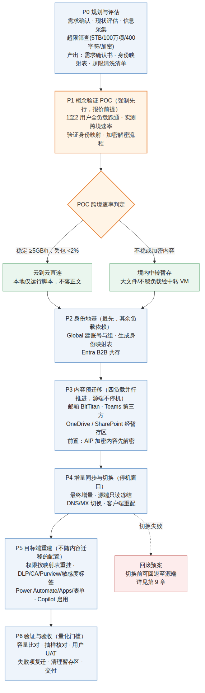

# Microsoft 365 整租户迁移技术方案（落地版）
## 从 Microsoft 365（21Vianet 世纪互联）到 Microsoft 365 Global

> 版本 v4.3.1 ｜ 可交付客户 ｜ 覆盖身份/邮箱/Teams/OneDrive/SharePoint 五大负载
>
> **v4.3.1 修订（2026-06-04）**：经与微软官方文档逐项核对，纠正 Teams 聊天迁移的关键判断——聊天/频道历史**可经官方 Graph 迁移模式（导入）API 写入目标为活跃会话（保真有损），且支持 21Vianet**；此前"仅能导出归档、无回写 API"的表述有误（实为 Export API 在 21V 不支持、Import API 支持）。涉及 §0.3、§2.4、§3.3、§3A.1、§3A.5、§3A.6、§4.5，新增信源 13。
> 数据基准：Microsoft 官方文档（每条硬论断附信源，见文末附录 A）；最后核实 2026-06
> 合规性由客户自行承担，本方案为纯技术工程方案

---

## 第 0 章 执行摘要

本方案针对客户 **Microsoft 365（由世纪互联运营，下称 21V）** 整租户跨云迁移至 **Microsoft 365 Global**，覆盖五大工作负载：**身份(Entra/AAD)、邮箱(Exchange)、Teams、OneDrive、SharePoint**。

### 0.1 核心结论

**微软原生跨租户迁移工具（Cross-Tenant Mailbox / SharePoint / OneDrive Migration）不适用于本项目。** 官方文档明确两点限制：其一，跨租户内容迁移全程在 Microsoft 365 云内完成（"Migrations occur within the Microsoft 365 cloud"）；其二，不支持 Government Cloud（GCC、GCC High、DoD）与 Consumer 等独立云环境〔信源 1、2〕。Microsoft 365（由世纪互联运营）是与 Global 物理隔离的独立主权云，与上述被排除的独立云属同一隔离性质。

> **说明（避免过度断言）**：截至本方案核实日期，微软官方文档未就"21Vianet 租户"逐字声明不支持原生跨租户迁移；上述结论系基于官方对独立云环境的排除条款与 21V 主权云隔离架构作出的工程推断，已在第 1.3 节给出完整判定依据。建议在 POC 阶段向微软或世纪互联渠道二次确认。

因此 **21V ↔ Global 迁移采用第三方工具（BitTitan，已与世纪互联合作支持 21V 端点〔信源 3〕）+ PnP 开源自建管线** 组合方案。

### 0.2 四项实施原则

1. **身份不可迁移，仅可重建与映射**：AAD Connect / ADMT 不跨主权云；Global 端新建账号，通过身份映射表（CSV）关联，是全项目的依赖基础。
2. **邮箱与 Teams 须用商业工具**：BitTitan 已与世纪互联合作，支持 21V 的 `*.partner.outlook.cn` 端点〔信源 3〕；Teams 聊天依赖 Cloudiway / Apps4.Pro，微软无原生跨云方案。
3. **加密内容迁移前必须解密**：源端 AIP / RMS 加密、敏感度标签（含用户自定义权限）会导致迁移失败〔信源 1、2〕。
4. **服务配置不随内容迁移**：Copilot / Purview / DLP / 保留策略 / 条件访问策略均须在 Global 端重建。

### 0.3 主要风险

身份零互通（身份映射表为关键依赖项）、AIP 加密内容处理、跨境带宽折损（官方同云速率不适用，须经 POC 实测）、Teams 聊天保真度损失。

---

## 第 1 章 现状评估：21V vs Global（官方事实依据）

### 1.1 架构层差异〔信源 4,5〕

| 维度 | 21V（世纪互联） | Global |
|---|---|---|
| 运营主体 | 世纪互联（独立法人，受中国法律管辖） | 微软 |
| 云边界 | 物理隔离的独立云实例 | Worldwide 商业云 |
| 身份端点 | login.partner.microsoftonline.cn | login.microsoftonline.com |
| Graph 端点 | microsoftgraph.chinacloudapi.cn | graph.microsoft.com |
| SharePoint/OneDrive 域 | *.sharepoint.cn | *.sharepoint.com |
| Exchange 域 | *.partner.outlook.cn | *.outlook.com |
| Teams 域 | teams.microsoftonline.cn | teams.microsoft.com |
| 租户互通 | 仅 Entra B2B 跨云协作，无原生联合 | — |
| 网络协议 | 仅 IPv4 | IPv4 + IPv6 |

### 1.2 服务可用性对照〔信源 4〕

| 功能 | 21V | Global | 迁移影响 |
|---|---|---|---|
| Exchange Online | ✅ | ✅ | 邮箱跨云迁移(第三方) |
| SharePoint/OneDrive | ✅ | ✅ | 核心内容可迁 |
| Teams | ✅ | ✅ | 文件可迁，聊天难迁 |
| Power Apps / Automate | ✅ | ✅ | 流程需重建 |
| **AIP / RMS** | ❌ | ✅ | **加密内容迁前必须解密** |
| **Forms / Planner / Stream** | ❌ | ✅ | 21V 无，无需迁 |
| **Sway / Delve / MyAnalytics** | ❌ | ✅ | 21V 无 |
| **Copilot** | ❌/滞后 | ✅ | Global 端新启用 |
| **高级数据治理 / 安全管理** | ❌ | ✅ | Global 端重建 |
| **eDiscovery 高级** | ❌/受限 | ✅ | 合规配置不随内容走 |
| 用户自助改密码 | ❌ | ✅ | 身份策略差异 |

### 1.3 为什么微软原生跨租户工具用不了（核心判定）

微软有三套原生 Cross-Tenant 工具，本项目**全部不适用**，官方依据如下：

| 原生工具 | 官方限制原文（要点） | 信源 |
|---|---|---|
| Cross-Tenant Mailbox Migration | 基于 Organization Relationship + `outlook.office.com`，在 EXO 内部路由 | 〔信源 1〕 |
| Cross-Tenant SharePoint Migration | "Migrations occur within the Microsoft 365 cloud"；内容只在云内移动 | 〔信源 2〕 |
| Cross-Tenant OneDrive Migration | "**Unsupported Environments: Government Cloud (GCC, Consumer, GCC High, DoD)**"；"Content never leaves Microsoft 365 cloud" | 〔信源 2〕 |

**判定逻辑**：原生工具的前提是源/目标处于**同一 Microsoft 365 商业云**，靠云内信任关系直接搬运。21V 是独立主权云，与 Global 之间**没有这条云内通道**，与 GCC 被排除是同一性质。→ **跨 21V↔Global 只能落地到云外第三方/自建管线。**

### 1.4 关键退役时间线

| 日期 | 事件 | 信源状态 |
|---|---|---|
| 2026-04-02 | SharePoint 2013 工作流从现有租户移除、正式退役；SharePoint Add-ins 停用 | 微软官方〔信源 6〕 |
| 2026-07-14 | InfoPath Forms Services 退役 | 微软官方〔信源 6〕 |
| 2026 内（待核实） | Teams 私有频道合规模型调整、独立版 SPO/OneDrive Plan 停售 | 需向微软渠道二次确认 |

> 上述前两项直接影响迁移：依赖旧工作流、Add-ins、InfoPath 的业务须在 Global 端现代化重建（Power Automate / Power Apps），无自动迁移工具。

### 1.5 各产品容量/数量限制对比（官方 Service Limits）〔信源 7,8〕

> 重要事实：21V 与 Global 同为 Microsoft 365 内核，**绝大多数技术 limits 完全一致**（下表"两环境"列若无差异即通用）。真正差异在 **1.6 功能可用性**（AIP/Forms/Stream/Copilot 等 21V 缺失）与跨云迁移工具约束。下表 limits 直接决定迁移盘点的"超限筛查"项。

**A. SharePoint Online 限制**

| 项目 | 限制值（两环境一致） | 迁移影响 |
|---|---|---|
| 单站点存储 | 25 TB | 跨租户迁移工具上限更严：**单站点 5TB**〔信源 2〕 |
| 站点数/租户 | 200 万 | — |
| 单文件上传 | 250 GB | 超大文件需特殊处理 |
| 路径长度 | 400 字符 | **迁移硬约束**，超限必改名〔信源 2〕 |
| 单列表/库项数 | 3000 万 | 迁移工具上限 **100 万项/站点**〔信源 2〕 |
| 列表/库数 | 2000/站点集 | — |
| 版本数 | 5 万主版本 + 511 次版本 | 迁全历史数据量×3–5 |
| 唯一权限(独立授权) | 5 万支持/5 千推荐 | **独立权限项越多迁移越慢**，>10万需脚本 |
| 容器>10万项 | 无法在容器层断/继承权限 | 大库权限重挂受限 |
| SharePoint 组 | 1 万组/站点；用户属 5 千组；每组 5 千人 | 组成员重挂规划 |
| 术语库 | 100 万术语 + 200 万标签 | PnP 单独迁 |
| 移动/复制单次 | 100 GB / 3 万文件 | 批量迁分包依据 |
| 跨 Geo 文件操作 | 15 GB/文件 | 跨实例约束 |
| 同步推荐上限 | 30 万文件/库 | 迁后同步规划 |

**B. Exchange Online 限制**

| 项目 | 限制值 | 21V vs Global | 迁移影响 |
|---|---|---|---|
| 用户邮箱(E3/E5) | 100 GB | 一致 | 大邮箱分批迁 |
| 用户邮箱(Basic/E1) | 50 GB | 一致 | — |
| 归档邮箱(E3/E5自动扩展) | 起 100GB→1.5 TB | 一致 | 单独配置迁移 |
| 共享邮箱 | 50 GB(无license)/100GB | 一致 | 单独建+重授权 |
| F3 邮箱 | 2 GB | 一致 | — |
| 单文件夹消息数 | 100 万（警告 90 万） | 一致 | 超限文件夹拆分 |
| 子文件夹/文件夹 | 1 万 | 一致 | — |
| 文件夹层级深度 | 300 级 | 一致 | — |
| 可恢复项(Hold) | 30 GB→100 GB | 一致 | Hold 邮箱迁移注意 |
| 接收速率 | 3600 封/小时 | 一致 | 迁移期不受影响 |
| 通讯组成员 | 10 万 | 一致 | 重建 |
| 动态通讯组 | 3000/租户 | 一致 | 规则重写 |
| 邮件大小 | 150 MB | 一致 | — |

**C. OneDrive for Business 限制**

| 项目 | 限制值 | 迁移影响 |
|---|---|---|
| 单盘存储 | 1–5 TB（按 plan，可申请更高） | 跨租户迁移 **5TB 上限**〔信源 2〕 |
| 单盘项数(迁移工具) | 100 万项 | 超限拆分〔信源 2〕 |
| 路径长度 | 400 字符 | 迁移硬约束〔信源 2〕 |
| 单文件 | 250 GB | — |
| 版本数 | 同 SharePoint（500 版本默认） | 全历史增量大 |
| 同步推荐上限 | 30 万文件 | 迁后同步规划 |

**D. Teams 限制**

| 项目 | 限制值 | 迁移影响 |
|---|---|---|
| 团队成员 | 25,000/团队 | 重挂成员 |
| 团队数/用户 | 1,000（创建/加入） | — |
| 频道数/团队 | 1,000（含已删） | 结构重建 |
| 私有频道/团队 | 30 | 第三方迁移 |
| 频道文件 | 存后端 SharePoint，受 SP 限制 | 同 SP 文件迁移 |
| 聊天消息 | 无完整跨云迁移保真 | 归档为主 |

### 1.6 功能可用性差异（21V 缺失项 = 迁移复杂度的主要来源）〔信源 4〕

| 功能 | 21V | Global | 迁移处置 |
|---|---|---|---|
| AIP / RMS 加密 | ❌ | ✅ | 源端加密内容迁前必须解密 |
| Microsoft Forms | ❌ | ✅ | 21V 无，无需迁 |
| Microsoft Stream | ❌ | ✅ | 21V 无；视频走文件迁移 |
| Microsoft Planner | ❌/受限 | ✅ | 21V 受限，按现状评估 |
| Sway / Delve / Viva | ❌ | ✅ | 21V 无 |
| Copilot | ❌ | ✅ | Global 新启用 |
| Purview 高级治理 | ❌ | ✅ | Global 重建合规 |
| eDiscovery（高级） | ❌/受限 | ✅ | 合规配置不随内容走 |
| 用户自助改密 | ❌ | ✅ | 身份策略差异 |
| IPv6 | ❌（仅 IPv4） | ✅ | 网络规划 |

> 小结：**容量 limits 在两环境基本一致，"功能是否可用"才是 21V→Global 的实质差异**。盘点重点不在比对容量数字，而在排查 21V 端 AIP 加密内容总量、是否存在依赖 Forms/Stream/Planner 的业务。

---

## 第 2 章 迁移整体方案（方法论）

### 2.0 整体流程图（端到端七阶段）

本方案采用统一的七阶段模型，下文各章节均以此为准。



| 阶段 | 名称 | 关键产出 |
|---|---|---|
| P0 | 规划与评估 | 需求确认书、身份映射表、超限清洗清单 |
| P1 | 概念验证 POC（强制先行，报价前提） | 跨境速率实测值、迁移路径判定 |
| P2 | 身份地基 | Global 账号/组、身份映射表定稿、B2B 共存 |
| P3 | 内容预迁移（四负载并行推进） | 邮箱/Teams/OneDrive/SharePoint 全量同步 |
| P4 | 增量同步与切换（停机窗口） | 最终增量、DNS/MX 切换 |
| P5 | 目标端重建 | 权限、合规策略、Power Platform、Copilot |
| P6 | 验证与验收 | 容量比对、抽样、UAT、交付报告 |

主线：规划评估 → POC 实测定速率 → 身份先行 → 四负载并行迁移内容 → 停机窗口切换 → 目标端重建配置 → 量化验收。其中身份是其余负载的依赖前置，POC 是报价的强制前提，切换前必须执行最终增量。切换失败时按第 9 章回滚预案回退至源端。

### 2.1 需求采集（五项必答）
1. **范围**：迁哪些负载？全部用户还是分批？
2. **保真度**：版本历史/元数据/权限/邮箱结构/Teams 历史保到什么程度？
3. **停机窗口**：可接受的只读/切换窗口多长？MX 切换时机？
4. **身份**：Global 账号是否就绪？UPN 规则？是否上 Entra B2B 共存？
5. **成功标准**：以什么验收（容量比对/抽样/UAT）？

→ 输出《迁移需求确认书》。

### 2.2 信息采集表

**A. 源环境（21V）采集指标**

| 类别 | 采集项 | 方式 |
|---|---|---|
| 身份 | 全部 UPN/显示名/SID、安全组、分发组、动态组规则、组成员关系 | Graph(China 端点)/Entra 导出 |
| 邮箱 | 邮箱数、各容量、归档大小、共享/资源邮箱、转发规则、委派 | EXO PowerShell |
| Teams | 团队数、频道(标准/私有)、成员、文件量、聊天量、App/Tab | Graph/Teams PowerShell |
| OneDrive | 用户数、各盘容量、共享链接、>5TB 或 >100万项告警 | PnP/Graph |
| SharePoint | 站点数、容量、内容类型、权限组、AIP 加密清单、旧工作流/InfoPath、>400字符路径 | PnP 扫描 |
| 风险 | 加密文档、敏感度标签、深路径/非法字符（含撇号'）、超大文件、外部共享 | PnP+手工 |

**B. 目标环境（Global）采集指标**

| 类别 | 采集项 |
|---|---|
| 就绪度 | 工作负载开通、容量配额、域名验证状态 |
| 身份 | 目标 UPN 规则、用户/组是否已建、Entra 同步状态 |
| 策略 | CA 策略（迁移账号需例外）、外部共享、DLP 现状、MFA |
| 配额 | 单站点/邮箱容量上限、API 限流阈值 |

→ 输出《环境信息采集表》+《身份映射表 CSV》（源 UPN → 目标 UPN，逐人）。

### 2.2.1 身份映射表 Schema（核心交付物，全项目依赖）

身份映射表是所有内容、权限、邮箱迁移做身份翻译的唯一依据，须在 P0 起草、P2 定稿、全程版本化。标准字段定义如下：

| 字段 | 类型 | 必填 | 说明 / 示例 |
|---|---|---|---|
| `SourceUPN` | string | 是 | 源 21V 用户主体名，`zhang@contoso.partner.onmschina.cn` |
| `SourceObjectId` | GUID | 是 | 源 Entra 对象 ID，唯一锚点，防同名歧义 |
| `SourcePrimarySmtp` | string | 是 | 源主邮箱地址，邮箱迁移匹配用 |
| `TargetUPN` | string | 是 | 目标 Global UPN，`zhang@contoso.com` |
| `TargetObjectId` | GUID | 否 | 目标账号建好后回填，供权限重挂引用 |
| `TargetPrimarySmtp` | string | 是 | 目标主邮箱地址 |
| `DisplayName` | string | 是 | 显示名，核对用 |
| `MigrationWave` | string | 是 | 批次标识，`Wave-01` / 部门名 |
| `Workloads` | string | 是 | 该用户涉及负载，`Mailbox;OneDrive;Teams` |
| `LicenseTarget` | string | 是 | 目标端待分配 License SKU |
| `Status` | enum | 是 | `Pending` / `AccountCreated` / `Migrating` / `Cutover` / `Done` / `Failed` |
| `HasLegalHold` | bool | 是 | 源邮箱是否有保留，`true` 须先解 hold |
| `Note` | string | 否 | 异常备注（同名冲突、特殊处置等） |

**配套映射表**（同样 schema 化，避免硬编码）：

- **组映射表** `GroupMap.csv`：`SourceGroupId, SourceGroupName, GroupType, TargetGroupId, TargetGroupName, MemberCountSource`
- **站点映射表** `SiteMap.csv`：`SourceSiteUrl, TargetSiteUrl, Template, StorageGB, OverLimit(bool)`

> 约束：①`SourceObjectId` / `SourceUPN` 全表唯一；②`TargetUPN` 不得重复；③`Status` 仅允许枚举值，驱动迁移编排与断点续传；④文件 UTF-8 编码、保留在迁移工作机本地并 Git 版本化（见 §3.6 数据分流）。

### 2.3 整体策略：身份先行 → 内容并行 → 切换收尾

七阶段（P0–P6）的核心策略逻辑：

- **身份先行（P2）**：Global 端建账号/组并生成身份映射表，是 P3–P5 所有内容/权限迁移的依赖前置；推荐叠加 Entra B2B 共存，降低一次性切换风险。
- **内容并行（P3）**：邮箱、Teams、OneDrive、SharePoint 四负载在项目管理层面并行推进，源端不停机。注意四负载的文件数据共享同一条跨境链路（见 §6.2），物理带宽为瓶颈时需排程错峰，并行指任务推进并行，非带宽叠加。每负载内部流程：预迁移全量 → 多轮增量 → 停机窗口最终增量。
- **切换收尾（P4–P6）**：停机窗口内最终增量 → 源端只读冻结 → DNS/MX 切换 → 目标端重建配置 → 量化验收。
- **批次组织**：按部门分批，每批遵循 POC → 全量 → 验收闭环。

### 2.4 技术选型总表

| 负载 | 首选 | 备选 | 依据 |
|---|---|---|---|
| 身份 | 手工脚本 + CSV 映射 | Quest/BitTitan 目录同步 | AAD Connect 不跨云 |
| 邮箱 | **BitTitan MigrationWiz**（官方支持 21V〔信源 3〕） | Quest On Demand | 微软原生不跨主权云 |
| Teams | Cloudiway / Apps4.Pro | AvePoint | 微软无原生跨云聊天迁移 |
| OneDrive | PnP / BitTitan | — | 同 SharePoint 文件 |
| SharePoint | PnP PowerShell(结构) + PnP/BitTitan(内容) | PnP.Framework(.NET) | 开源主力，能连 `.cn` |

**原则**：结构与文件优先使用开源工具（PnP，零 License 成本）；邮箱与 Teams 跨云无原生路径，须采购商业工具保障可靠性。**不推荐 ShareGate**（对 21V 端点的支持情况未经官方确认）。

> **客户不认可商业工具时**：邮箱与 Teams 提供全开源 / 自研脚本替代路线（imapsync+OAuth2 自建邮箱管线、Graph 迁移模式 API 自建 Teams 聊天导入、PnP/Graph 自研文件管线），能力边界、保真度差距与投入对比详见**第 3A 章**。核心取舍：身份+文件走开源无让步，邮箱可自建（日历/联系人需补管线），Teams 聊天可经官方迁移模式 API 导入为活跃会话（保真有损，支持 21V），非仅归档。

### 2.5 步骤与时间成本（中型 ~500 用户 / 500GB 参考）

> 下表周期为经验估算区间，最终工期以 P1（POC）实测跨境速率为准锁定，详见第 6 章测算方法。

| 阶段 | 工作内容 | 周期 |
|---|---|---|
| P0 规划与评估 | 需求确认、信息采集、身份映射表初稿 | 1–2 周 |
| P1 概念验证 POC | 1–2 用户全负载跑通、实测跨境速率 | 1 周 |
| P2 身份地基 | Global 建账号与组、Entra B2B 共存 | 1–2 周 |
| P3 内容预迁移 | 四负载全量同步（含历史） | 3–5 周（受跨境带宽制约） |
| P4 增量同步与切换 | 最终增量、MX / DNS 切换 | 1–2 周 |
| P5 目标端重建 | 权限、Power Automate、表单、服务配置 | 1–2 周 |
| P6 验证与验收 | 容量比对、抽样、用户验收 | 1 周 |
| **合计** | | **约 9–14 周** |

---

## 第 3 章 各负载详细迁移方案（可实施）

### 3.1 身份（Entra ID / AAD）—— 基础前置，最先执行

**要点：身份不可迁移。** AAD Connect、ADMT 不跨 China-Global 主权云，仅能在 Global 端重建并通过映射表关联。

**步骤：**
1. **导出源对象**：Graph(China 端点)导出全部用户 UPN、显示名、邮箱、安全组、分发组、组成员关系。
2. **目标建账号**：Global 端批量建用户/组（有本地 AD 则经 AAD Connect 同步，纯云则 CSV 批量建号）。
3. **生成映射表**：核心交付物 `源UPN→目标UPN` 逐人 CSV，所有内容/权限/邮箱迁移依赖它做身份翻译。
4. **共存（推荐）**：Global 端经 Entra B2B 邀请 21V 用户为来宾，迁移期两端协作，降低一次性切换风险。
5. **密码/MFA**：不可迁，新号需重设并重注册 MFA。

**不可迁**：源 SID、CA 策略、MFA 注册、密码哈希 → 全 Global 端重建。

### 3.2 邮箱（Exchange Online）

**要点：跨主权云微软原生不支持，主力工具为 BitTitan MigrationWiz（官方支持 21V 端点〔信源 3〕）。**

**步骤：**
1. **预检**：盘点容量、归档、共享/资源邮箱、转发规则、委派；**确认无 Legal Hold**（有 hold 会阻断迁移〔信源 1〕，需先移除迁后重挂）。
2. **目标准备**：Global 端按映射表建邮箱（随身份阶段）。
3. **预迁移（不停机）**：BitTitan 全量同步邮件/日历/联系人/任务，源邮箱保持正常使用。
4. **Delta 增量**：迁移期反复跑增量。
5. **切换**：窗口内最终增量 → 切 MX/Autodiscover 指向 Global。
6. **共存期收发**：B2B + 邮件转发保证不丢信。

**可迁**：邮件、日历、联系人、任务、归档、文件夹结构、规则（多数）。
**有条件**：共享/资源邮箱（单独建+重授权）、委派权限（重设）、Hold 邮箱（先解 hold）。
**不可迁**：客户端配置、部分传输规则/MailTips（Global 重建）。

### 3.3 Teams

**要点（v4.3.1 修正）：Teams 聊天/频道历史可经微软官方 Graph 迁移模式 API（`startMigration` → `importMessage` → `completeMigration`）写入目标频道/聊天，保真有损但可迁移；该 API 官方标注支持 China（21Vianet）〔信源 13〕。** 商业工具（Cloudiway / Apps4.Pro / AvePoint）封装的正是这套机制，亦可自行脚本化（见 §3A.5）。Teams 私有频道合规模型在 2026 年有调整计划（具体日期待向微软渠道核实），迁移前需确认目标端合规策略已应用到团队 group。

> **重要更正**：本方案早期版本曾表述"微软无原生跨云 Teams 聊天迁移、只能导出归档"，经与微软官方文档逐项核对，该表述有误，现予纠正——**迁移模式导入 API 可将消息写入目标为活跃会话（保真有损），且支持 21V**；反而是 **Teams Export（导出）API 在 21V 不受支持**〔信源 13〕。

| Teams 对象 | 可迁性 | 工具/处置 |
|---|---|---|
| 团队 + 标准频道结构 | ✅ | Graph 建团队/第三方/脚本重建 |
| 私有频道 | ⚠️ | 迁移模式 API/第三方，注意合规模型变更 |
| 频道文件（后端 SharePoint） | ✅ | PnP/第三方（同文件迁移） |
| 频道消息历史 | ⚠️ 保真有损 | **Graph 迁移模式 API 导入**（第三方/自研脚本封装同一机制） |
| 1:1/群聊私聊 | ⚠️ 保真有损 | **Graph `chat` 迁移模式 API 导入**（保真度低于频道） |
| Tabs/Apps/Connectors | ❌ | Global 端重新配置 |
| Planner（团队关联） | ⚠️ | 第三方部分支持 |

> **迁移模式 API 约束**：仅应用权限 `Teamwork.Migrate.All`（不支持委派）；导入期间频道对用户显示"导入模式"横幅，完成后移除；作者须为同租户身份（按身份映射表翻译）；消息时间戳须毫秒级唯一。保真损失点：@提及、reactions、部分富格式、附件内联关系可能降级，须 POC 实测确认客户可接受度。


**策略**：文件优先（高价值、可高保真）；聊天历史**可经迁移模式 API 导入为活跃会话（保真有损），亦可按项目需要仅做归档**——按客户对聊天保真度的诉求与预算二选一，POC 阶段实测保真损失后定。

### 3.4 OneDrive for Business

**要点：OneDrive 本质为每用户一个 SharePoint 文档库，迁移方式同 SharePoint 文件（PnP / BitTitan）。**

**步骤：**
1. 按映射表确认源盘→目标用户对应。
2. 目标端预置 OneDrive（注意：**目标盘不能预先存在，否则失败**〔信源 2〕——此为原生工具限制，第三方亦建议清洁目标）。
3. PnP/BitTitan 全量迁文件 + 版本历史（显式开）+ 元数据。
4. Delta 增量 → 窗口期最终增量。
5. **共享链接失效**：迁后重新生成并通知。

**硬限制（盘点须筛查）**：单盘 >5TB 或 >100万项、路径 >400字符、URL 含撇号' → 需预处理。

### 3.5 SharePoint（架构/元数据/模板/服务）

**"结构-内容-权限-自定义"四层分离：**

**① 结构层（架构/模板）**
- PnP `Get-PnPSiteTemplate` 导出站点模板（内容类型、网站栏、列表定义、视图、导航、页面、母版/品牌）。
- Global 建空壳站点 → `Invoke-PnPSiteTemplate` 重放。

**② 内容层（文件/列表/元数据）**
- PnP 批处理迁文件 + 列表项。
- **版本历史**：需显式配置，否则只迁最新版。
- **元数据**（作者/修改时间）：PnP `SystemUpdate` 保留。
- **Managed Metadata 术语库**：PnP 单独迁。
- 大体量用 PnP.Framework(.NET) 多线程提速。

**③ 权限层**
- 内容到位后按映射表重挂权限组+成员。
- 独立权限项（broken inheritance）逐一处理；外部共享链接重建。

**④ 自定义/服务层（Global 重建）**
- Power Automate/Apps、旧工作流、InfoPath、SPFx/第三方 WebPart、Site Scripts/Designs、DLP/保留/标签/Copilot —— 全部重建/重配。
- **敏感度标签（含用户自定义权限）迁前必须移除**〔信源 2〕，用 `Unlock-SPOSensitivityLabelEncryptedFile` 解密。

### 3.6 文件搬运路径：云到云 vs 本地中转（决策）

**结论：默认云到云直连，不落本地；仅命中特定例外才上"境内中转 VM"（非客户本地服务器）。**

#### 为什么默认不落地
1. **多一次搬运 = 翻倍工期 + 翻倍出错面**：落本地 = 先跨境下载（出 21V）→ 再跨境上传（进 Global），两段跨境；直连是一条管线，BitTitan/PnP 还自带 Azure 中转优化。
2. **元数据/版本/权限会被剥离**：文件落到本地文件系统（NTFS）后，SharePoint 的作者/修改人/修改时间/版本历史/权限**全部丢失**，再上传只能靠工具重映射，反而损失本可保留的元数据。
3. **本地存储双重压力**：中型 0.5–2TB、大型更多，本地需准备等量磁盘，且跨境带宽两端均被占用。

#### 工具实际管线（均不经客户本地）
| 工具 | 数据路径 | 客户本地是否落数据 |
|---|---|---|
| PnP / SharePoint Migration API | 源读取 → 打包上传 **Azure 临时容器** → 写目标 | 否（中转在微软 Azure） |
| BitTitan MigrationWiz | 源 ↔ **BitTitan 云** ↔ 目标（纯 SaaS） | 否 |
| Graph delta | 直接 API 拉取增量 | 否 |

→ 两者均为"云到云"，客户只提供凭据与配置，**数据不过客户的盘**。

#### 仅以下例外才本地/境内中转（有意识的预处理，非默认）
| 场景 | 处置 |
|---|---|
| **AIP/RMS 加密文件** | 必须先解密。优先在线 `Unlock-SPOSensitivityLabelEncryptedFile`；无法在线时下载→解密→汇入主管线 |
| **跨境带宽差/丢包高** | 上**境内一台中转 VM**（非办公室服务器）用 rclone 暂存，分段重传抗断点 |
| **深度清洗/重组** | 迁前剔重、改名、>400 字符路径预处理，本地暂存批处理更便于操作 |
| **合规留底** | 客户要求迁前在境内留原始副本存档 |

#### 决策流程（POC 速率判定）
```
POC 实测跨境直连速率
  ├─ 稳定（持续 ≥5 GB/h，丢包 <2%）         → 云到云直连，本地只跑脚本不存数据
  ├─ 不稳（丢包 ≥2% 或频繁断点）             → 境内中转 VM + rclone，仅对大文件/不稳负载用
  └─ 加密内容                               → 单拉预处理线解密，解完汇入主管线
```

**境内中转 VM 参考配置（仅例外时启用）**
```bash
# 境内 VM 上 rclone 暂存 + 分段重传（抗跨境断点）
rclone copy 21v:"Shared Documents" /mnt/stage/siteA \
  --transfers 8 --checkers 16 --retries 10 \
  --low-level-retries 20 --drive-chunk-size 64M
# 解密后/清洗后再 PnP 或 BitTitan 汇入目标 Global
```
> 注意：中转 VM 只承担"暂存 + 重传 + 解密/清洗"，**不替代权限/元数据迁移**——这些仍须经 PnP `SystemUpdate` + 身份映射表在目标端重建。

#### 数据分流：CSV 清单 vs 文件正文（两条流，分开存）

跨云迁移有两条数据流，存放位置不同，别混为一谈：

| 数据流 | 含什么 | 体积 | 存放位置 | 理由 |
|---|---|---|---|---|
| **元数据/映射 CSV** | 站点清单、容量、路径、权限映射、**身份映射表**、超限清洗清单 | 极小（MB 级，无正文） | **迁移工作机本地磁盘** | 要反复人工改、Git 留版本、断点续传频繁读写；不含文档正文，合规压力低 |
| **迁移日志 / checkpoint** | 已迁/失败/重试记录 | 小 | 同 CSV 本地（加密归档留底） | 审计与续传 |
| **文件正文本体** | 文档内容（非 CSV） | 大（GB–TB） | **Global 区域 Azure 暂存（Blob/Files）** | 跨境大数据走 Azure 骨干，弹性容量、生命周期可控、访问日志全 |

**为什么正文用 Global 侧 Azure 暂存，而非客户本地：**
- 21V（境内）→ Global（境外）这一跳是**数据出境**，无论存哪都触发，避不开；
- 正文落客户本地内网反而**加重合规审查面**（内网留正文副本）；Azure 暂存可设 SAS 临时授权 + 生命周期自动清 + 访问日志，**更易审计**；
- 暂存区设在 Global 同区域，上传 Global SharePoint 走内网就近，比从境内本地上传快。

**推荐落地架构：**
```
[21V SharePoint] ──PnP 盘点──> CSV(本地磁盘:映射表/清单/checkpoint)
       │                              │ 人工清洗 + 填身份映射
       │ PnP Get-PnPFile              ▼
       └──正文──> [Azure Blob 暂存(Global 区域)] ──PnP Add-PnPFile──> [Global SharePoint]
                        │ SAS 临时授权 + 生命周期 7 天自动清 + 访问日志留存
```

> 具体 PnP 命令(跨云盘点→Azure 暂存→重放)见配套《PnP PowerShell 知识图谱与实战》§7。
> **合规红线**：正文出境触发数据出境评估（数据分类、是否含个人信息/重要数据），属法务/客户决策，技术不能绕过。正式迁移前须客户书面确认已完成出境合规评估。

**小结**：数据默认不经客户本地磁盘；仅当 POC 证明直连不可行时，才启用境内中转 VM，且仅对大文件、加密、不稳定负载使用。

---

## 第 3A 章 纯开源 / 自研脚本替代路线（商业工具不可用时）

> **本章定位**：第 3 章默认路线在邮箱与 Teams 上采购商业工具（BitTitan / Cloudiway）换取可靠性与保真度。**若客户因预算、数据敏感（不接受数据过第三方 SaaS 云）、采购合规或自主可控要求，不认可商业工具**，本章给出**全程开源工具 + 自研脚本**的等价替代路线。两条路线就同一负载**二选一**，不叠加。
>
> **诚实定性**：文件类负载（SharePoint/OneDrive）本就以开源 PnP 为主力，替代成本低、保真度等价；**邮箱与 Teams 没有等价开源工具**，自研路线用开源协议库 + 微软官方 API 自建管线，**可达成数据搬运，但在保真度、自动化度、工程人力上对商业工具有明确折损**——下表逐项标注，不掩盖差距。

### 3A.1 开源 / 自研替代能力边界对照

| 负载 | 默认（商业/原生） | 开源 / 自研替代 | 保真度差距 | 主要代价 |
|---|---|---|---|---|
| 身份 AAD | 手工脚本 + CSV（**本就是脚本**） | 同上，无差异 | 无 | — |
| 邮箱 Exchange | BitTitan（21V 端点官方支持〔信源 3〕） | **imapsync + OAuth2** 自建〔信源 10、11〕 | 邮件正文/文件夹高保真；**日历/联系人/任务需另走 EWS/Graph**，规则/委派/MailTips 重建 | 自研脚本 + 逐账号 OAuth；并发与限流要自己控 |
| Teams 聊天 | Cloudiway / Apps4.Pro | **Graph 迁移模式 API 自研导入**〔信源 13〕 | 保真有损（@提及/reactions/富格式可能降级），但可写入为活跃会话 | 仅 App 权限 `Teamwork.Migrate.All`；导入态横幅；时间戳毫秒唯一；自写编排 |
| Teams 结构/文件 | 第三方 | **Graph 建团队 + PnP 迁后端文件**（开源） | 等价 | 自研建团队脚本 |
| OneDrive | PnP / BitTitan | **PnP / Graph 自研**（开源） | 等价 | 同 SharePoint |
| SharePoint 结构 | PnP（**本就开源**） | 同上，无差异 | 无 | — |
| SharePoint 内容/权限 | PnP / BitTitan | **PnP + 自研 .NET/Python 多线程**（开源） | 等价（元数据靠 `SystemUpdate`、权限靠映射表，与默认路线同机制） | 大体量需自写并发/重试/checkpoint |

**一句话决策**：身份与 SharePoint/OneDrive 走开源**无任何让步**；邮箱用 imapsync 自建管线可接受（差距在日历/联系人需补管线）；**Teams 聊天可经官方迁移模式 API 自研导入为活跃会话（保真有损）**——开源路线相比商业工具不损失"可迁性"本身，仅在保真度（@提及/reactions/富格式）与编排工程量上有差距，须 POC 实测保真损失并与客户书面确认可接受度。

### 3A.2 身份（AAD）—— 纯脚本，与默认路线一致

默认路线本就是「Graph 导出 + CSV 映射 + 批量建号」，**无商业工具依赖**，开源路线完全相同。补充自动化要点：

```powershell
# 源端 21V 导出（China 端点）
Connect-MgGraph -Environment China -Scopes "User.Read.All","Group.Read.All"
Get-MgUser  -All -Property UserPrincipalName,DisplayName,Mail,Department |
  Export-Csv source_users.csv -NoTypeInformation
Get-MgGroup -All | ForEach-Object {
  $m = Get-MgGroupMember -GroupId $_.Id -All
  [PSCustomObject]@{ Group=$_.DisplayName; Members=($m.AdditionalProperties.userPrincipalName -join ';') }
} | Export-Csv source_group_members.csv -NoTypeInformation

# 目标端 Global 批量建号（按映射表 targetUPN 列）
Import-Csv id_mapping.csv | ForEach-Object {
  New-MgUser -UserPrincipalName $_.targetUPN -DisplayName $_.DisplayName `
    -MailNickname $_.Nickname -AccountEnabled `
    -PasswordProfile @{ Password=$_.InitPwd; ForceChangePasswordNextSignIn=$true }
}
```
- 身份映射表 Schema 见 §2.2.1（全程所有负载共用同一张表）。
- 密码/MFA/CA 策略不可迁，目标端重建，与默认路线一致。

### 3A.3 邮箱（Exchange）—— imapsync + OAuth2 自建管线

**核心可行性依据**：微软 Basic Auth 仅在 **2026 年底**默认禁用 SMTP AUTH，而 **IMAP/POP/SMTP 的 OAuth2（XOAUTH2）现代认证一直受官方支持且为长期方向**〔信源 10〕。开源工具 `imapsync` 支持以 OAuth2 token 登录 Microsoft 365，是跨服务器逐邮件复制的成熟方案〔信源 11〕。

**端点（21V 走 China 域名）**：
- 源 IMAP：`outlook.office365.com` 在 Global；**21V 为 `partner.outlook.cn`（IMAP 主机 `imap-mail.partner.outlook.cn`，993/SSL）**。
- 认证：两端各注册一个 Entra App（源在 21V 租户、目标在 Global 租户，App 不跨云通用），授 `IMAP.AccessAsUser.All` / `https://outlook.office365.com/IMAP.AccessAsApp`（App-only）权限，用 client_credentials 取每用户 token。

**步骤：**
1. **预检**：盘点邮箱容量、归档、共享/资源邮箱、转发规则、委派；**确认无 Legal Hold / In-Place Hold**（hold 阻断或干扰迁移，先解除迁后重挂）。
2. **目标准备**：Global 端按映射表建邮箱（随身份阶段），确认目标 IMAP 已启用。
3. **两端 App 授权**：分别注册 App，App-only 模式授 `IMAP.AccessAsApp` 并经管理员同意；脚本用 MSAL 取目标用户 token。
4. **逐账号同步**（可并发，建议夜间批跑）：

```bash
# 每账号一行，token 由 MSAL 脚本预取注入（--oauth2 走 XOAUTH2）
imapsync \
  --host1 imap-mail.partner.outlook.cn --user1 "$SRC_UPN" \
  --oauth2 "$SRC_TOKEN" \
  --host2 outlook.office365.com        --user2 "$DST_UPN" \
  --oauth2 "$DST_TOKEN" \
  --automap --addheader --useuid \
  --maxsize 150000000 --skipsize 0 \
  --logdir ./imapsync_logs --logfile "$SRC_UPN.log"
# --automap 自动匹配 Inbox/Sent/已发送等本地化文件夹名；--useuid 支持增量重跑
```
5. **多轮 Delta**：imapsync 以 UID 去重，反复跑即增量（已迁邮件跳过），与商业工具的 Delta 等价。
6. **窗口期最终增量 → 切 MX/Autodiscover** 指向 Global，与默认路线一致。

**保真度与边界（必须如实告知客户）：**
- ✅ **可迁**：邮件正文、附件、文件夹结构、已读/未读/标记状态、单封邮件元数据（IMAP 范围内）。
- ⚠️ **IMAP 协议范围外，须另建管线**：
  - **日历 / 联系人 / 任务** 不走 IMAP — 用 **EWS（OAuth）或 Graph 导出 `.ics`/`.vcf` 后导入目标**，或目标端经 Graph `POST /users/{id}/events`、`/contacts` 重建。
  - **收件规则 / 委派 / 自动答复 / MailTips** — 目标端经 Exchange Online PowerShell 脚本重建。
  - **归档邮箱（In-Place Archive）** — 作为独立 IMAP 根另跑一轮。
- ❌ **不可迁**：客户端配置、部分传输规则（Global 重建）。
- **限流**：M365 IMAP 有每连接节流，单账号过高并发会触发临时锁定；脚本须实现指数退避 + per-mailbox 并发上限（经验值 ≤4 并发/账号、租户级总连接受控），这部分**节流控制是自研路线的主要工程量**，商业工具已内置。

### 3A.4 文件三负载（SharePoint / OneDrive）—— 本就开源，自研补强大体量

SharePoint 结构层（PnP `Get-PnPSiteTemplate` / `Invoke-PnPSiteTemplate`）与内容层（PnP 批处理 + `SystemUpdate` 保元数据 + 术语库单独迁）**默认路线已是开源 PnP，无需替代**。商业工具在此仅为「省人力」，非「补能力」。客户拒绝商业工具时，大体量靠**自研并发管线**补强：

- **方案 A：PnP.Framework（.NET）多线程** — `CopyTo` / `Add-PnPFile -Stream` 并发，自写 checkpoint（已迁/失败/重试落 CSV，断点续传）。
- **方案 B：Microsoft Graph + Python/Node 自研** — `GET /sites/{id}/drive/root/delta` 拉增量，`PUT /drive/items/{id}/content`（>4MB 走 `createUploadSession` 分块）写目标；用 `asyncio`/worker pool 控并发。
- **元数据/版本/权限机制与默认路线完全相同**：版本历史显式开、`SystemUpdate` 保作者时间、独立权限项（`HasUniqueRoleAssignments`）按映射表逐条重挂。**自研只换"搬运引擎"，不改"保真机制"**。
- **大文件不用 `-AsMemoryStream`**（GB 级整文件进内存必 OOM）：≥250MB 走磁盘临时文件 + `Add-PnPFile -Path` 触发 SPO 分块上传（详配套手册 §7.5）。

### 3A.5 Teams —— 结构/文件可自研等价，聊天可经迁移模式 API 自研导入

| Teams 对象 | 开源 / 自研替代 | 保真度 |
|---|---|---|
| 团队 + 标准频道结构 | Graph `POST /teams`、`/channels` 自研重建（读源结构→目标重建） | ✅ 等价 |
| 频道文件（后端 SharePoint） | PnP 迁文档库（同 §3A.4） | ✅ 等价 |
| 频道 / 1:1 / 群聊消息历史 | **Graph 迁移模式 API 自研导入**（`startMigration` → `importMessage` → `completeMigration`）〔信源 13〕 | ⚠️ 保真有损，但可写为活跃会话 |
| Tabs / Apps / Connectors | Global 端重新配置 | ❌ 重建 |
| Planner（团队关联） | Graph Planner API 自研部分迁 | ⚠️ 部分 |

**Teams 聊天的自研导入路线（关键纠正）：**
- **可迁，且支持 21V**：微软官方 Graph **迁移模式（migration mode）** API 允许把外部/源消息**写入**目标频道或聊天为活跃会话。`channel:completeMigration` 与 `chat:startMigration` 官方页 National Cloud 栏均标注 **✅ China（21Vianet）**〔信源 13〕；微软产品组在 sp-dev-docs Issue #9019 亦确认 Import Migration API 支持 21V 用户。商业工具（Cloudiway/Apps4.Pro）封装的正是这套机制,可自行脚本化。
- **此前误判已纠正**：本方案早期版本把 Teams 聊天错述为"仅能用 Export API 导出归档、无回写 API"。事实相反——**Export（导出）API 在 21V 不受支持**，而**迁移模式 Import API 受支持**。Export 路线在本场景反而走不通,Import 才是正解。
- **约束与保真损失**：① 仅应用权限 `Teamwork.Migrate.All`（不支持委派）；② 导入期间频道/聊天显示"导入模式"横幅，`completeMigration` 后移除；③ 消息作者须为目标租户已存在身份（按身份映射表翻译,跨云身份须先建好）；④ 时间戳须毫秒级唯一且早于线程 `createdDateTime`；⑤ 保真损失点：@提及解析、reactions、部分富格式/卡片、附件内联关系可能降级。**须 POC 实测保真损失并与客户书面确认可接受度**。
- **结论**：开源/自研路线**不损失"可迁性"本身**——聊天可迁为活跃会话；相比商业工具的差距在保真度细节与编排工程量（自写 startMigration/importMessage 批处理、限流、checkpoint、身份映射）。文件与团队结构开源等价交付。若客户核心诉求是"聊天迁过去还能接着聊",此路线可满足,保真度以 POC 为准。

### 3A.6 投入对比：License 省了，人力涨了

| 维度 | 默认（商业工具）路线 | 开源 / 自研路线 |
|---|---|---|
| 工具 License | BitTitan ~$14/邮箱、UMB ~$17.5/用户〔信源 9〕；Teams 第三方订阅 | **¥0**（imapsync/PnP/Graph SDK 全免费） |
| 邮箱工程 | 配置即用，Delta/限流内置 | 自研 OAuth 取 token + 并发/退避/日历联系人补管线（**主要新增人力**） |
| 文件工程 | 工具托管 | 与默认路线相近（本就 PnP） |
| Teams | 第三方聊天迁移（保真有损但自动） | Graph 迁移模式 API 自研导入 + 自研建团队（**可迁为活跃会话，工程量增**） |
| 数据路径 | 经 BitTitan SaaS 云（数据过第三方） | **不过任何第三方 SaaS**（数据仅经自控脚本 + Azure 暂存，**自主可控更强**） |
| 可靠性 | 厂商 SLA + 报告 | 自负责，须自建监控/校验 |
| 工期影响 | 基准 9–14 周 | **+1～3 周**（邮箱补管线 + Teams 自研 + 联调），规模越大并发工程占比越高 |

> **本质权衡**：开源/自研路线用**工程人力 + 自主可控性**换取**零 License + 数据不过第三方**。对数据敏感、强调自主可控、或邮箱/用户量不大的客户更划算；对超大规模（数千邮箱）且预算充足的客户，商业工具的内置限流/Delta/报告仍更省心。**建议按"身份+文件走开源、邮箱看规模、Teams 聊天确认预期"做混合选型**，而非全盘二选一。

---

## 第 4 章 迁移范围矩阵（细颗粒：产品 → 组件 → 对象 → 工具）

> 维度说明：**可迁性** ✅可迁 / ⚠️有条件（需预处理或保真有损） / ❌不可迁（目标端重建）。
> 工具列为推荐主力，所有跨云迁移的身份引用均依赖 §3.1 身份映射表。

### 4.1 身份（Microsoft Entra ID / AAD）

| 组件 | 对象 | 可迁性 | 工具 / 处置 |
|---|---|---|---|
| 用户账号 | UPN / 显示名 / 基本属性 | ⚠️ | 不迁，按映射表 Global 重建（Graph 导出→批量建号） |
| 用户账号 | 密码哈希 | ❌ | 不可迁，新号重设密码 |
| 用户账号 | ObjectID / SID | ❌ | 必变，所有引用按映射表翻译 |
| 认证 | MFA 注册 / FIDO / Authenticator | ❌ | 目标端用户重新注册 |
| 认证 | 条件访问(CA)策略 | ❌ | Global 重建（迁移账号需设例外） |
| 组 | 安全组 / 通讯组 + 成员 | ⚠️ | 重建+按映射表重挂成员（Graph/脚本） |
| 组 | 动态组规则 | ⚠️ | 规则重写（属性可能变） |
| 组 | M365 组（含归属 SP/Teams） | ⚠️ | 随 SP/Teams 迁移特殊重建 |
| 应用 | 企业应用 / 应用注册 / SPN | ❌ | Global 重新注册+授权 |
| 设备 | Entra 已加入/混合加入设备 | ❌ | 重新加入目标租户 |
| 角色 | 目录角色分配 | ❌ | Global 重新指派 |
| 许可 | License 分配 | ❌ | Global 重新购买+分配 |

### 4.2 邮箱（Exchange Online）

| 组件 | 对象 | 可迁性 | 工具 / 处置 |
|---|---|---|---|
| 邮箱内容 | 邮件 / 文件夹结构 | ✅ | BitTitan |
| 邮箱内容 | 日历 / 会议 | ✅ | BitTitan |
| 邮箱内容 | 联系人 | ✅ | BitTitan |
| 邮箱内容 | 任务 / 便笺 | ✅ | BitTitan |
| 邮箱内容 | 归档邮箱(In-Place Archive) | ✅ | BitTitan（单独配置） |
| 邮箱内容 | 收件箱规则 | ⚠️ | 多数可迁，复杂规则核对 |
| 邮箱内容 | 类别 / 标志 | ⚠️ | 部分保真 |
| 特殊邮箱 | 共享邮箱 | ⚠️ | 目标端单独建+重授权 |
| 特殊邮箱 | 资源邮箱（会议室/设备） | ⚠️ | 单独建+重设预订策略 |
| 权限 | 完全访问 / 发送为 / 代表发送 | ⚠️ | 目标端按映射表重设委派 |
| 合规 | 诉讼保留 / 就地保留(Hold) | ⚠️ | 先解 hold→迁→重挂〔信源 1〕 |
| 邮箱 | 单邮箱 > 100GB / 归档超限 | ⚠️ | 分批迁，注意配额 |
| 配置 | 传输规则 / 连接器 / 接受域 | ❌ | Global 重建 |
| 配置 | MailTips / OOF 自动回复模板 | ❌ | Global 重配 |
| 配置 | 邮件流 / DLP 邮件策略 | ❌ | Global 重建 |
| 审计 | 邮箱审计日志 | ❌ | 源端归档留存 |

### 4.3 OneDrive for Business

| 组件 | 对象 | 可迁性 | 工具 / 处置 |
|---|---|---|---|
| 文件 | 文档 / 文件夹 | ✅ | PnP / BitTitan |
| 文件 | 版本历史 | ⚠️ | 需显式开启（数据量×3–5） |
| 文件 | 元数据（作者/修改时间） | ⚠️ | PnP `SystemUpdate` 保留 |
| 共享 | 内部共享链接 | ⚠️ | 失效，迁后重建 |
| 共享 | 外部/匿名共享链接 | ⚠️ | 失效，B2B 重邀+重授权 |
| 权限 | 文件/文件夹独立权限 | ⚠️ | 按映射表重挂 |
| 限制 | 单盘 > 5TB / > 100万项 | ❌ | 超限须拆分/清理〔信源 2〕 |
| 限制 | 路径 > 400 字符 / 含撇号' | ⚠️ | 迁前改名/重组〔信源 2〕 |
| 加密 | AIP/RMS 加密文件 | ⚠️ | 迁前解密〔信源 2〕 |
| 其他 | 回收站内容 | ❌ | 不迁 |
| 其他 | 与本地同步状态 | ❌ | 目标端重新配置同步 |

### 4.4 SharePoint Online

| 组件 | 对象 | 可迁性 | 工具 / 处置 |
|---|---|---|---|
| 内容 | 文档库文件 | ✅ | PnP / BitTitan |
| 内容 | 列表项 | ✅ | PnP / BitTitan |
| 内容 | 版本历史 | ⚠️ | 需显式开启 |
| 内容 | 元数据（作者/修改时间） | ⚠️ | PnP `SystemUpdate` |
| 结构 | 内容类型 | ✅ | PnP `Get/Invoke-PnPSiteTemplate` |
| 结构 | 网站栏 / 列定义 | ✅ | PnP 模板 |
| 结构 | 列表/库定义 / 视图 | ✅ | PnP 模板 |
| 结构 | 导航 / 站点结构 | ✅ | PnP 模板 |
| 结构 | 页面 / 新闻 | ⚠️ | 现代页面可迁，含 WebPart 需核对 |
| 结构 | 母版页 / 品牌 / 主题 | ⚠️ | 现代主题可迁，经典自定义需重做 |
| 元数据服务 | Managed Metadata 术语库 | ✅ | PnP 单独迁 |
| 权限 | SharePoint 组 + 成员 | ⚠️ | 按映射表重建 |
| 权限 | 权限级别（标准） | ✅ | 目标端默认存在 |
| 权限 | 权限级别（自定义） | ⚠️ | 重建 |
| 权限 | 独立权限项(broken inheritance) | ⚠️ | 逐项扫描+按映射表重挂（脚本+抽样）|
| 权限 | 外部共享 / 来宾访问 | ⚠️ | B2B 重邀+重授权 |
| 加密 | AIP/RMS 加密文件 | ⚠️ | 迁前解密〔信源 2〕 |
| 加密 | 敏感度标签（用户自定义权限） | ⚠️ | 迁前必须移除〔信源 2〕 |
| 限制 | 单站点 > 5TB / > 100万项 | ❌ | 拆分〔信源 2〕 |
| 自定义 | Power Automate 流 | ❌ | Global 重建+重连 |
| 自定义 | Power Apps | ❌ | Global 重建 |
| 自定义 | 2010/2013 工作流 | ❌ | 重建/现代化（2026/4 停运）〔信源 6〕 |
| 自定义 | InfoPath 表单 | ❌ | 重做（2026/7 退役）〔信源 6〕 |
| 自定义 | SPFx / 第三方 WebPart | ❌ | 重新部署 |
| 自定义 | Site Scripts / Site Designs | ❌ | Global 重建 |
| 自定义 | SharePoint Add-ins | ❌ | 重做（2026/4 停用）〔信源 6〕 |
| 合规 | DLP / 保留策略 / 标签 | ❌ | Global 重配 |

### 4.5 Microsoft Teams

| 组件 | 对象 | 可迁性 | 工具 / 处置 |
|---|---|---|---|
| 团队 | 团队 + 标准频道结构 | ✅ | Cloudiway / 脚本重建 |
| 团队 | 频道文件（后端 SharePoint） | ✅ | PnP / 第三方（同 SP 文件） |
| 团队 | 团队成员 / 所有者 | ⚠️ | 按映射表重挂 |
| 频道 | 私有频道 | ⚠️ | 第三方，注意 2026 年合规模型调整（日期待核实） |
| 频道 | 共享频道(Shared Channel) | ⚠️ | 第三方支持有限 |
| 消息 | 频道消息历史 | ⚠️ 保真有损 | Graph 迁移模式 API 导入（第三方/自研封装同机制） |
| 消息 | 1:1 / 群组私聊历史 | ⚠️ 保真有损 | Graph `chat` 迁移模式 API 导入（保真度低于频道） |
| 应用 | Tabs（标签页） | ❌ | Global 重新配置 |
| 应用 | Apps / Bots / Connectors | ❌ | Global 重新安装配置 |
| 通话 | 通话记录 / 语音信箱 | ❌ | 不迁 |
| 通话 | 电话系统 / 呼叫策略 | ❌ | Global 重建 |
| 会议 | 会议录制 | ⚠️ | 作为文件迁（Stream/OneDrive） |
| 关联 | Planner（团队关联） | ⚠️ | 第三方部分支持 |
| 配置 | 团队策略 / 消息策略 | ❌ | Global 重配 |

### 4.6 服务 / 合规配置（跨负载，全部 Global 重建）

| 组件 | 对象 | 可迁性 | 处置 |
|---|---|---|---|
| 安全 | 条件访问 / MFA / 身份保护 | ❌ | Global 重建 |
| 合规 | Purview DLP / 保留 / 敏感度标签 | ❌ | Global 重配（21V 多无此能力） |
| 合规 | eDiscovery / 审计日志 | ❌ | 源端归档 |
| AI | Copilot 及其配置 | ❌ | Global 新启用 |
| 治理 | 信息屏障 / 访问审查 | ❌ | Global 重建 |

---

## 第 5 章 成本估算

### 5.1 构成
**总成本 = 工具 License + 人力 + 基础设施 + 风险缓冲**

### 5.2 工具 License
| 工具 | 用途 | 成本 |
|---|---|---|
| PnP / Graph / rclone | 结构 + 文件 + OneDrive | **¥0**（开源） |
| BitTitan MigrationWiz（Mailbox License） | 邮箱迁移 | **$14.00 / 用户**（一次性，有效期 12 个月）〔信源 9〕 |
| BitTitan MigrationWiz（User Migration Bundle, UMB） | 邮箱 + 文档（OneDrive）合并 | **$17.50 / 用户**（一次性，有效期 12 个月）〔信源 9〕 |
| Cloudiway / Apps4.Pro | Teams 聊天 / 频道 | 按团队或用户订阅（以厂商报价为准） |

> **BitTitan 计价说明**〔信源 9〕：
> - 上列为官方在线牌价（2025-06-01 调整后），实际企业采购可能有渠道折扣，最终以 BitTitan 报价为准。
> - UMB 标称 "unlimited data"，但 **Teams 迁移与共享文档迁移各自上限 100GB / license**，超出需追加许可，邮箱+OneDrive 大体量项目须据此核算。
> - 计价示例（仅工具 License）：500 用户邮箱按 Mailbox License 约 **$7,000**；若用 UMB（含 OneDrive）约 **$8,750**。Teams 第三方工具与基础设施另计。

### 5.3 人力（主要成本项，9–14 周）
| 角色 | 投入 |
|---|---|
| 迁移架构师 | 0.5–1 人 × 全程 |
| 身份/映射工程师 | 1 人 × 前 4 周 |
| PnP/脚本工程师 | 1–2 人 × 全程 |
| 邮箱/Teams 工程师 | 1 人 × 内容期 |
| 测试/验收 | 0.5 人 × 后期 |

### 5.4 基础设施
- 境内中转 VM/存储（rclone 暂存）：¥数百–数千/月
- 跨境带宽/专线提速：按需单列

### 5.5 成本-规模参考
| 规模 | 用户/容量 | 推荐路线 | 量级 |
|---|---|---|---|
| 小 | <50 用户/<100GB | 纯开源 PnP + BitTitan 邮箱 | 3–5 周 × 1–2 人 |
| 中 | ~500 用户/~500GB | PnP + BitTitan + Teams 第三方 | 9–14 周 × 团队 + license |
| 大 | >2000 用户/>2TB | 商业工具主力 + PnP 结构 | 4–8 月 × 团队 + 订阅 |

---

## 第 6 章 迁移速率与工期测算（事实依据）

### 6.1 微软官方速率（仅供上限参考，同云 SharePoint Migration API）〔信源 7〕

| 内容类型 | 示例 | 官方最大速率 |
|---|---|---|
| 轻量 | ISO/视频大文件 | 10 TB/天 |
| 中等 | 列表项、Office 文件(~1.5MB) | 1 TB/天 |
| 重型 | 含自定义列列表项、小文件(~50KB) | 250 GB/天 |

**节流不可关闭**：工作日白天限速，**夜间/周末吞吐更高**〔信源 7〕。队列上限 5000 jobs，>100TB 需提工单。

### 6.2 跨境折损（本项目真实约束）

上表是**同云内 API 速率**，本项目走**云外第三方/PnP 经境内外网络**，会显著折损：
- 跨租户第三方经验值约 5–8 GB/小时（多连接并行），小文件密集更低；
- **21V 出境到 Global 比普通跨租户更慢**，受跨境带宽/丢包制约。
- → **真实速率必须 POC 实测后才能锁工期**，禁止用官方同云速率估跨境工期。

### 6.3 测算方法
1. POC 实测单位时间迁移量（含小文件、版本历史、加密占比）；
2. 总量 ÷ 实测速率 × 安全系数(1.5–2) = 内容期工期；
3. 安排夜间/周末跑批利用高吞吐窗口。

---

## 第 7 章 POC（强制先行，给报价的前提）

选取 1–2 名代表用户（含邮箱 + OneDrive + 所属团队 + 代表性站点，建议包含加密内容）执行全负载验证：
1. 验证工具连 **China endpoint**（PnP `-AzureEnvironment China` / BitTitan 选 "Office 365 China (21Vianet)"）—— 最大不确定性
2. 实测**跨境速率** —— 锁工期关键变量
3. 验证**身份映射**端到端
4. 验证**邮箱/Teams/文件**保真（版本/元数据/聊天）
5. 验证 **AIP 加密/敏感度标签**处理流程

**POC 通过 → 才给全量工期与精确报价。**

---

## 第 8 章 信息采集清单与脚本

> 采集是报价和工期的依据。先采全、再筛超限项、再估量。所有源端连接必须带 **China 端点**。

### 8.1 采集清单（Checklist）

**① 身份与组**
- [ ] 全部用户：UPN、显示名、邮箱、账号状态、License
- [ ] 安全组 / 通讯组 / M365 组 + 成员关系
- [ ] 动态组规则、目录角色分配
- [ ] 来宾用户（外部协作）清单

**② 邮箱（Exchange）**
- [ ] 各邮箱容量、归档大小、类型（用户/共享/资源）
- [ ] 转发规则、委派权限、收件箱规则数
- [ ] **Legal Hold / 诉讼保留状态**（阻断迁移，须先记录）
- [ ] 超限项：单邮箱 >90GB、单文件夹 >90 万消息

**③ OneDrive**
- [ ] 各盘容量、文件数、版本占用
- [ ] 超限筛查：>5TB、>100 万项、路径 >400 字符、文件名含 `'`
- [ ] 外部共享链接清单

**④ SharePoint**
- [ ] 站点清单：URL、模板类型、容量、项数
- [ ] 内容类型、网站栏、术语库规模
- [ ] **独立权限项(broken inheritance)计数**（决定权限工期）
- [ ] AIP 加密文件 / 敏感度标签清单
- [ ] 旧工作流(2010/2013)、InfoPath、SPFx/第三方 WebPart、Power Automate/Apps
- [ ] 超限筛查：>5TB、>100 万项、>400 字符路径

**⑤ Teams**
- [ ] 团队/频道数（标准/私有/共享）、成员、所有者
- [ ] 频道文件量、聊天消息量（估归档规模）
- [ ] Tabs / Apps / Connectors / 关联 Planner

**⑥ 风险项汇总**
- [ ] AIP 加密内容总量与占比
- [ ] 深路径 / 非法字符项
- [ ] 超大文件（>100GB）
- [ ] 外部共享 / 来宾访问范围

→ 输出《环境信息采集表》+《超限清洗清单》+《身份映射表 CSV》。

### 8.2 采集脚本（源端 21V，可直接跑）

**前置：安装模块**
```powershell
Install-Module Microsoft.Graph -Scope CurrentUser
Install-Module PnP.PowerShell -Scope CurrentUser
Install-Module ExchangeOnlineManagement -Scope CurrentUser
```

**① 身份与组采集（Graph，China 端点）**
```powershell
Connect-MgGraph -Environment China -Scopes "User.Read.All","Group.Read.All","Directory.Read.All"

# 全部用户
Get-MgUser -All -Property Id,UserPrincipalName,DisplayName,Mail,AccountEnabled,AssignedLicenses |
  Select-Object UserPrincipalName,DisplayName,Mail,AccountEnabled,
    @{N='Licenses';E={($_.AssignedLicenses.SkuId) -join ';'}} |
  Export-Csv .\source_users.csv -NoTypeInformation -Encoding UTF8

# 组 + 成员
$groups = Get-MgGroup -All -Property Id,DisplayName,GroupTypes,SecurityEnabled,MailEnabled
$rows = foreach ($g in $groups) {
  $members = Get-MgGroupMember -GroupId $g.Id -All
  [pscustomobject]@{
    GroupName=$g.DisplayName
    Type=($g.GroupTypes -join ';')
    Security=$g.SecurityEnabled; Mail=$g.MailEnabled
    MemberCount=$members.Count
    Members=($members.AdditionalProperties.userPrincipalName -join ';')
  }
}
$rows | Export-Csv .\source_groups.csv -NoTypeInformation -Encoding UTF8

# 身份映射表模板（待人工/规则填目标 UPN）
Import-Csv .\source_users.csv |
  Select-Object UserPrincipalName,
    @{N='TargetUPN';E={$_.UserPrincipalName -replace '@.*','@company.onmicrosoft.com'}} |
  Export-Csv .\identity_map.csv -NoTypeInformation -Encoding UTF8
```

**② 邮箱采集（Exchange Online，China 端点）**
```powershell
Connect-ExchangeOnline -ExchangeEnvironmentName O365China

# 邮箱清单 + 容量 + 类型
$mbx = Get-Mailbox -ResultSize Unlimited
$rows = foreach ($m in $mbx) {
  $stat = Get-MailboxStatistics $m.Identity
  [pscustomobject]@{
    UPN=$m.UserPrincipalName; Type=$m.RecipientTypeDetails
    SizeMB=[math]::Round(($stat.TotalItemSize.Value.ToBytes()/1MB),0)
    Items=$stat.ItemCount
    Archive=$m.ArchiveStatus
    LitigationHold=$m.LitigationHoldEnabled
    InPlaceHolds=($m.InPlaceHolds -join ';')
  }
}
$rows | Export-Csv .\source_mailboxes.csv -NoTypeInformation -Encoding UTF8

# Hold 邮箱单独筛（阻断迁移）
$rows | Where-Object {$_.LitigationHold -eq $true -or $_.InPlaceHolds} |
  Export-Csv .\mailboxes_on_hold.csv -NoTypeInformation -Encoding UTF8
```

**③ SharePoint / OneDrive 采集（PnP，China 端点）**
```powershell
$adminUrl = "https://xxx-admin.sharepoint.cn"
Connect-PnPOnline -Url $adminUrl -AzureEnvironment China -Interactive

# 站点清单 + 容量 + 项数
$sites = Get-PnPTenantSite -IncludeOneDriveSites
$rows = foreach ($s in $sites) {
  [pscustomobject]@{
    Url=$s.Url; Template=$s.Template
    StorageMB=$s.StorageUsageCurrent
    Owner=$s.Owner
    IsOneDrive=($s.Url -like '*-my.sharepoint.cn*')
  }
}
$rows | Export-Csv .\source_sites.csv -NoTypeInformation -Encoding UTF8

# 超限筛查：>5TB 或 OneDrive >100万项
$rows | Where-Object {$_.StorageMB -gt 5242880} |
  Export-Csv .\sites_over_5tb.csv -NoTypeInformation -Encoding UTF8
```

**④ 单站点深扫：独立权限项 + 深路径 + 加密**
```powershell
Connect-PnPOnline -Url "https://xxx.sharepoint.cn/sites/A" -AzureEnvironment China -Interactive

# 独立权限项(broken inheritance)计数 —— 决定权限工期
$lists = Get-PnPList | Where-Object {$_.Hidden -eq $false}
foreach ($l in $lists) {
  $items = Get-PnPListItem -List $l -PageSize 500
  $unique = $items | Where-Object {
    (Get-PnPProperty -ClientObject $_ -Property HasUniqueRoleAssignments)
  }
  "[$($l.Title)] 独立权限项: $($unique.Count) / 总 $($items.Count)"
}

# 深路径筛查(>400字符)
Get-PnPListItem -List "Documents" -PageSize 500 -Fields FileLeafRef,FileRef |
  Where-Object { $_.FieldValues.FileRef.Length -gt 380 } |
  Select-Object @{N='Path';E={$_.FieldValues.FileRef}},
    @{N='Len';E={$_.FieldValues.FileRef.Length}} |
  Export-Csv .\deep_paths.csv -NoTypeInformation -Encoding UTF8
```

**⑤ Teams 采集（Graph）**
```powershell
# 团队 + 频道 + 成员
$teams = Get-MgTeam -All
$rows = foreach ($t in $teams) {
  $channels = Get-MgTeamChannel -TeamId $t.Id -All
  $members  = Get-MgTeamMember  -TeamId $t.Id -All
  [pscustomobject]@{
    Team=$t.DisplayName
    ChannelCount=$channels.Count
    PrivateChannels=($channels | ?{$_.MembershipType -eq 'private'}).Count
    MemberCount=$members.Count
  }
}
$rows | Export-Csv .\source_teams.csv -NoTypeInformation -Encoding UTF8
```

> 脚本产出统一目录归档，作为《环境信息采集表》底稿与报价依据。所有 `.cn` / `O365China` / `-Environment China` 标记是连 21V 的关键，连错端点会落到 Global 空租户。

---

## 第 9 章 回滚与失败预案

跨主权云迁移不可逆操作集中在切换阶段（P4），本章定义各阶段失败时的回退策略与判定门槛。核心原则：**切换（MX/DNS 切换 + 源端只读冻结）之前，源环境始终完整可用，可零损失回退**。

### 9.1 回退点与策略

| 阶段 | 失败场景 | 可否回退 | 回退动作 |
|---|---|---|---|
| P2 身份 | 账号/组建错、映射表有误 | 完全可回退 | 修正映射表，源端无任何改动 |
| P3 预迁移 | 内容迁移失败、保真不达标 | 完全可回退 | 源端只读未启用、仍在用；清理目标端不完整数据后重迁 |
| P4 切换（关键） | 最终增量失败 / 切换后发现严重问题 | **切换前可回退** | 见 9.2 切换回滚流程 |
| P5 重建 | 权限/服务配置重建错误 | 可修正 | 目标端按映射表重做，不影响已迁内容 |
| P6 验收 | 抽样/容量比对不达标 | 部分回退 | 失败项复迁；若系统性问题按 9.2 整体回滚 |

### 9.2 切换回滚流程（P4 关键窗口）

**回滚触发条件（满足任一即触发）：**
- 最终增量同步失败率 > 5%，且无法在停机窗口内修复；
- 切换后核心业务（邮件收发 / 文件访问）验证不通过；
- 目标端出现数据完整性问题（容量比对偏差超 9.3 门槛）。

**回滚动作（切换窗口内，源端尚未释放）：**
1. **暂停切换**：停止 DNS/MX 变更或回切 MX 指向源 21V；
2. **解除源端只读冻结**：恢复源邮箱/站点读写，用户回到源环境办公；
3. **保留目标端数据**：不删除已迁内容，供问题定位，确认无误后再启动二次切换；
4. **根因分析**：定位失败原因（速率/权限/加密/映射），修复后重新执行 P4。

**DNS/MX 回切前提**：迁移前将相关 DNS 记录 TTL 预降至 300 秒，确保回切可快速生效。

> **不可回退红线**：一旦源端正式释放（账号注销 / License 回收 / 源数据删除），不可回退。源端释放须在 P6 验收全部通过、且预留观察期（建议 ≥2 周）后执行。

### 9.3 验收量化标准（P6 门槛）

验收不接受主观判断，须满足以下量化门槛方可签收：

| 维度 | 量化门槛 | 验证方法 |
|---|---|---|
| 容量一致性 | 目标端总容量 ≥ 源端 99%（差异需逐项解释，如回收站/版本策略差异） | 源/目标容量比对脚本 |
| 文件数一致性 | 文件/项目数差异 ≤ 1% | 计数比对 |
| 抽样核对 | 随机抽样 ≥ 每负载 30 个对象（或总量 1%，取大值），内容/元数据/版本逐一核对，准确率 100% | 人工抽样 + 脚本 |
| 邮箱迁移 | BitTitan 报告失败项 = 0；抽样邮箱邮件数/文件夹结构一致 | 工具报告 + 抽样 |
| 权限正确性 | 抽样站点权限与源端一致率 100%（按映射表翻译后） | 权限比对脚本 |
| 用户验收 UAT | 抽样用户（≥ 总数 5%）确认邮件、文件、Teams 可正常访问 | 用户签字确认 |
| 失败项 | 全部失败对象已复迁成功或经客户书面确认豁免 | 失败清单闭环 |

> 任一维度不达标即不予验收，进入失败项复迁或按 9.2 回滚。

---

## 附录 A：信源（官方文档）

> 标注「Microsoft Learn / Microsoft Support」者为微软官方一手文档；其余为厂商官方或行业参考，已注明。所有链接最后核实于 2026-06。

1. Cross-tenant mailbox migration — Microsoft Learn
   `https://learn.microsoft.com/en-us/microsoft-365/enterprise/cross-tenant-mailbox-migration`
2. Cross-tenant OneDrive migration — Microsoft Learn（含"Unsupported Environments: GCC/Consumer/GCC High/DoD"、内容不离开 M365 云、5TB/100万项/400字符限制）
   `https://learn.microsoft.com/en-us/sharepoint/cross-tenant-onedrive-migration`
   Cross-tenant SharePoint migration overview — Microsoft Learn（敏感度标签需移除、单站点 5TB/100万项上限）
   `https://learn.microsoft.com/en-us/microsoft-365/migration/cross-tenant-sharepoint-migration`
3. BitTitan × 世纪互联蓝云（21Vianet Blue Cloud）合作页（MigrationWiz 支持 21V）— 厂商官方
   `https://en.21vbluecloud.com/solution/bittitan`
4. Microsoft 365 operated by 21Vianet — Service Descriptions — Microsoft Learn
   `https://learn.microsoft.com/en-us/office365/servicedescriptions/office-365-platform-service-description/microsoft-365-operated-by-21vianet`
5. Power Platform and Dynamics 365 apps operated by 21Vianet（China 云端点/域名差异）— Microsoft Learn
   `https://learn.microsoft.com/en-us/power-platform/admin/about-microsoft-cloud-china`
6. SharePoint 2013 workflow retirement — Microsoft Support（2026-04-02 工作流退役）
   `https://support.microsoft.com/en-us/office/sharepoint-2013-workflow-retirement-4613d9cf-69aa-40f7-b6bf-6e7831c9691e`
   InfoPath Forms Services 退役（2026-07-14）— 见微软 M365 路线图与退役公告
7. Migration performance guide for SharePoint & OneDrive（官方速率与节流）— Microsoft Learn
   `https://learn.microsoft.com/en-us/sharepointmigration/sharepoint-online-and-onedrive-migration-speed`
8. SharePoint limits / Exchange Online limits — Service Descriptions（容量/数量/路径/版本/权限等官方 limits，第 1.5 章对比表依据）— Microsoft Learn
   `https://learn.microsoft.com/en-us/office365/servicedescriptions/sharepoint-online-service-description/sharepoint-online-limits`
   `https://learn.microsoft.com/en-us/office365/servicedescriptions/exchange-online-service-description/exchange-online-limits`
9. BitTitan MigrationWiz Pricing（Mailbox License $14.00 / UMB $17.50，2025-06-01 调整；UMB 的 Teams 与共享文档各 100GB 上限）— 厂商官方
   `https://www.bittitan.com/pricing-bittitan-migrationwiz`
   User Migration Bundle 说明：`https://www.bittitan.com/migrationwiz/user-migration-bundle`
10. Authenticate an IMAP, POP or SMTP connection using OAuth — Microsoft Learn（IMAP/POP/SMTP 的 OAuth2/XOAUTH2 官方支持，开源邮箱自研路线的认证依据）
    `https://learn.microsoft.com/en-us/exchange/client-developer/legacy-protocols/how-to-authenticate-an-imap-pop-smtp-application-by-using-oauth`
    Deprecation of Basic authentication in Exchange Online（Basic Auth 2026 年底默认禁用、OAuth2 为长期方向）
    `https://learn.microsoft.com/en-us/exchange/clients-and-mobile-in-exchange-online/deprecation-of-basic-authentication-exchange-online`
11. imapsync — 开源 IMAP 邮箱迁移工具，支持 Microsoft 365 OAuth2 登录 — 官方/社区文档
    `https://imapsync.lamiral.info/` ｜ `https://github.com/imapsync/imapsync/discussions/435`
12. Export content with the Microsoft Teams Export APIs + Payment models（Teams **Export/导出** API，2025-08-25 起不再计费、仍为 protected API 需审批且用户须 E5/G5；**注：Export API 在 21V 不受支持**，本场景聊天迁移改用迁移模式 Import API，见信源 13）— Microsoft Learn
    `https://learn.microsoft.com/en-us/microsoftteams/export-teams-content`
    `https://learn.microsoft.com/en-us/graph/teams-licenses`
13. Teams **迁移模式（导入）** API：channel/chat `startMigration` → `importMessage` → `completeMigration`，把外部消息写入目标为活跃会话；官方 National Cloud 栏标注 **✅ China（21Vianet）**，仅应用权限 `Teamwork.Migrate.All`；产品组 sp-dev-docs Issue #9019 确认支持 21V 用户 — Microsoft Learn / GitHub
    `https://learn.microsoft.com/en-us/microsoftteams/platform/graph-api/import-messages/import-external-messages-to-teams`
    `https://learn.microsoft.com/en-us/graph/api/channel-completemigration?view=graph-rest-1.0`
    `https://learn.microsoft.com/en-us/graph/api/chat-startmigration?view=graph-rest-1.0`
    `https://github.com/SharePoint/sp-dev-docs/issues/9019`

> **信源性质声明**：第 0.1、1.3 节关于"21V 不适用原生跨租户迁移"的结论，是基于信源 1、2 中对独立云环境（GCC/Consumer 等）的明文排除条款，结合信源 4、5 所述 21V 主权云隔离架构作出的工程推断，非微软对 21V 的逐字声明，须在 POC 阶段二次确认。

---

## 附录 B：核心命令参考

```powershell
# === 身份导出(源 21V) ===
Connect-MgGraph -Environment China
Get-MgUser -All  | Export-Csv source_users.csv
Get-MgGroup -All | Export-Csv source_groups.csv

# === SharePoint 结构(源) ===
Connect-PnPOnline -Url https://xxx.sharepoint.cn/sites/x `
  -AzureEnvironment China -Interactive
Get-PnPSiteTemplate -Out source.pnp -IncludeAllPages -PersistBrandingFiles

# === SharePoint 结构重放(目标 Global) ===
Connect-PnPOnline -Url https://xxx.sharepoint.com/sites/x -Interactive
Invoke-PnPSiteTemplate -Path source.pnp

# === 解密敏感度标签加密文件(迁前) ===
Unlock-SPOSensitivityLabelEncryptedFile `
  -FileUrl "https://xxx.sharepoint.cn/sites/x/Shared Documents/Doc1.docx" `
  -JustificationText "Pre-migration decryption"

# === OneDrive/文件增量(Graph delta) ===
GET /sites/{id}/drive/root/delta

# === 邮箱: BitTitan MigrationWiz ===
# 源端点选 "Office 365 China (21Vianet)"，目标 "Office 365 Worldwide"
# 全量 → 多轮 Delta → 窗口期最终增量 → 切 MX
# 迁前确认邮箱无 Legal Hold

# === Teams: Cloudiway/Apps4.Pro ===
# 团队结构+文件高保真；聊天历史按需归档
```

## 相关

- [[40-调研报告/迁移方案/PnP-PowerShell知识图谱与实战|PnP-PowerShell 知识图谱与实战]] — SharePoint/OneDrive 结构重放的 PnP-PowerShell 命令体系与实战手册
